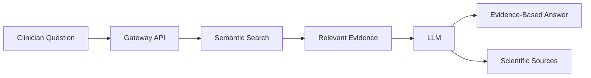
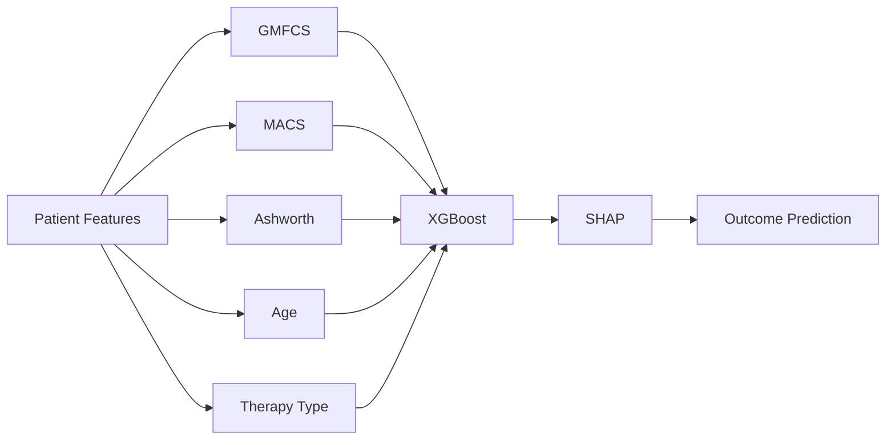

# NeuroAtlas AI

AI-powered Clinical Decision Support System for Pediatric Neurorehabilitation.

## Vision

NeuroAtlas AI is a research-driven platform designed to support clinicians in pediatric neurorehabilitation.

The platform combines:

- Machine Learning (ML)
- Retrieval-Augmented Generation (RAG)
- Large Language Models (LLMs)

to help clinicians interpret patient data, evaluate functional outcomes, and navigate scientific evidence.

---

## Core Components

### Clinical Data

Patient assessments:

- GMFCS
- MACS
- Ashworth Scale
- Range of Motion
- Clinical Notes
- Imaging Data

### Machine Learning

Predictive models for:

- Functional outcomes
- Rehabilitation progress
- Risk assessment

### RAG

Evidence retrieval from:

- PubMed
- Clinical Guidelines
- Research Publications

### LLM

Natural language explanations supported by scientific evidence.

---

## Architecture

Clinical Data
    |
    v
Machine Learning
    |
    +------+
           |
           v
         LLM
           ^
           |
         RAG
           ^
           |
      PubMed Data

---

## Project Status

Research Phase

Current focus:

- Literature review
- Dataset discovery
- Clinical workflow analysis
- Outcome prediction design

---

## Roadmap

### Phase 1

Research

- Review CP literature
- Identify datasets
- Contact researchers

### Phase 2

RAG MVP

- PubMed ingestion
- Embeddings
- Vector search

### Phase 3

ML MVP

- Outcome prediction
- XGBoost baseline
- Explainability with SHAP

### Phase 4

Unified Platform

- ML + RAG + LLM
- FastAPI backend
- Web application

---

## Disclaimer

NeuroAtlas AI is a research project and is not intended for diagnosis or clinical decision-making.

## NeuroAtlas AI Workflow

## Future Clinical Prediction Pipeline

