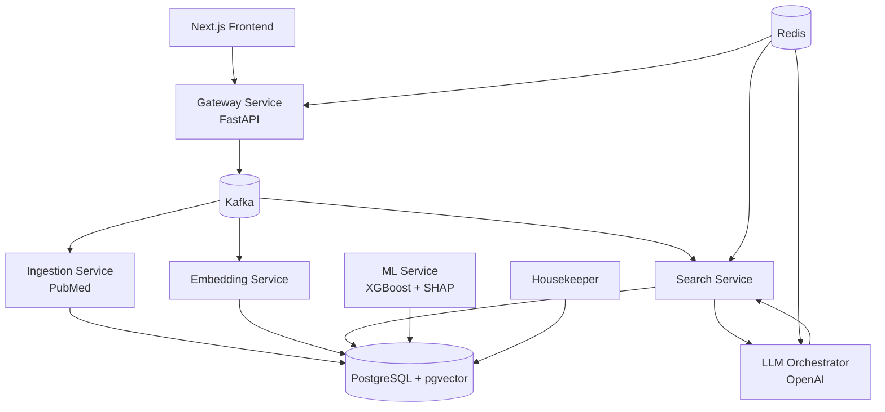

# NeuroAtlas AI Architecture

## 1. Vision

NeuroAtlas AI is a clinical decision support platform for pediatric neurorehabilitation.

The platform combines:

* Evidence Retrieval (RAG)
* Clinical Knowledge Base
* Outcome Prediction (ML)
* Explainable AI

Initial clinical focus:

* Pediatric Hemiparesis
* Hemiplegic Cerebral Palsy (Unilateral CP)
* Pediatric Neurorehabilitation

Long-term goal:

Build an evidence-based AI assistant that helps clinicians access scientific literature, analyze patient data, and eventually support outcome prediction.

---

## 2. Core Principles

The platform must:

* Remain evidence-based
* Never hallucinate scientific evidence
* Always provide citations
* Explain ML predictions
* Support future clinical research
* Follow clean architecture principles
* Remain modular and scalable (see [§12 Microservice Architecture Alignment](#12-microservice-architecture-alignment))

---

## 3. High-Level Architecture

```text
                                        ┌──────────────────────────────┐
                                        │        Web App (UI)          │
                                        │      Next.js / React         │
                                        └───────────────┬──────────────┘
                                                        │ HTTPS / JSON
                                        ┌───────────────▼──────────────┐
                                        │      API Gateway             │
                                        │          FastAPI             │
                                        │ auth · validation · audit    │
                                        └───────────────┬──────────────┘
                                                        │
                                          Request / Events
                                                        │
                                        ┌───────────────▼──────────────┐
                                        │           Kafka              │
                                        │      Event Backbone          │
                                        └──────┬────────┬────────┬─────┘
                                               │        │        │
                    ┌──────────────────────────┘        │        └─────────────────────────┐
                    │                                   │                                  │
                    ▼                                   ▼                                  ▼

        ┌──────────────────────┐      ┌──────────────────────┐      ┌──────────────────────┐
        │   Ingestion Service  │      │  Embedding Service   │      │    Search Service    │
        │      PubMed          │      │ Embedding Pipeline   │      │ Semantic Retrieval   │
        │ Guidelines Import    │      │ OpenAI / BGE Models  │      │ Similarity Search    │
        │ Metadata Extraction  │      │ Vector Generation    │      │ Context Assembly     │
        └──────────┬───────────┘      └──────────┬───────────┘      └──────────┬───────────┘
                   │                             │                             │
                   └──────────────┬──────────────┴──────────────┬──────────────┘
                                  │                             │
                                  ▼                             ▼

                    ┌────────────────────────────────────────────────────┐
                    │            PostgreSQL + pgvector                  │
                    │                                                    │
                    │ Articles                                           │
                    │ Chunks                                             │
                    │ Embeddings                                         │
                    │ Clinical Metadata                                  │
                    │ Future Feature Store                               │
                    └───────────────────────┬────────────────────────────┘
                                            │
                                            │ Retrieved Context
                                            ▼

                            ┌─────────────────────────────────┐
                            │      LLM Orchestrator          │
                            │        LlamaIndex             │
                            │      Prompt Builder           │
                            │      Citation Engine          │
                            └───────────────┬───────────────┘
                                            │
                                            ▼

                            ┌─────────────────────────────────┐
                            │         LLM Provider           │
                            │ OpenAI / Anthropic / vLLM      │
                            └─────────────────────────────────┘


 ┌──────────────────────┐                                 ┌──────────────────────┐
 │      Redis           │                                 │    Housekeeper       │
 │ Response Cache       │                                 │ Alembic Migrations   │
 │ Session Storage      │                                 │ Schema Management    │
 │ Rate Limiting        │                                 │ DB Health Checks     │
 │ Temporary State      │                                 │ Query Monitoring     │
 └──────────┬───────────┘                                 └──────────┬───────────┘
            │                                                      │
            └──────────────────────────┬───────────────────────────┘
                                       │
                                       ▼

                    ┌────────────────────────────────────┐
                    │         ML Service                 │
                    │      XGBoost + SHAP                │
                    │ Outcome Prediction Engine          │
                    │ (Future Phase)                     │
                    └────────────────────────────────────┘
```

---

## 4. Service Responsibilities

### Gateway Service

Headless **API Gateway** for all non-browser clients (mobile, partners, scripts). Single
HTTPS entry: JWT validation, routing, rate limiting, audit. **Planned** post-Pioneer (NLS-50..51).

See [auth-api-gateway-flow.md](diagrams/auth-api-gateway-flow.md) and [edge-architecture.md](diagrams/edge-architecture.md).

Responsibilities:

* REST API routing to internal services
* Authentication at the edge (Keycloak JWT)
* Authorization
* Validation
* Audit Logging
* Rate Limiting
* Publishing Kafka Events (future)

Technology:

* FastAPI

---

### Admin UI Service

**Browser BFF** for clinicians: embedded React SPA, Keycloak OIDC login, session cookies,
guard proxy to backends. **Pioneer** entry point on port **8000** (NLS-61..69).

See [auth-admin-ui-browser-flow.md](diagrams/auth-admin-ui-browser-flow.md).

Responsibilities:

* OIDC authorization-code flow (login, callback, refresh, logout)
* Session cookies (split JWT pattern, planned)
* Serve React admin panel (`/patients`, etc.)
* Reverse proxy `/guard/api/v1/*` → patients / ml / housekeeper
* Forward `Authorization: Bearer` Keycloak JWT to backends

Technology:

* FastAPI + React (Vite)

**Target layout:** `src/admin_ui/` — see [edge-architecture.md](diagrams/edge-architecture.md).

---

### Ingestion Service

Responsibilities:

* PubMed Search
* Article Retrieval
* Metadata Extraction
* Full Text Processing
* Chunk Generation

Outputs:

* ArticleImported Event

Future Sources:

* Clinical Guidelines
* Registries
* Institutional Knowledge Bases

---

### Embedding Service

Responsibilities:

* Embedding Generation
* Embedding Updates
* Vector Storage
* Embedding Versioning

Technology:

* OpenAI Embeddings
* BGE Models
* Sentence Transformers

Outputs:

* EmbeddingsGenerated Event

---

### Search Service

Responsibilities:

* Similarity Search
* Context Retrieval
* Ranking
* Metadata Filtering

Technology:

* pgvector

Outputs:

* SearchCompleted Event

---

### LLM Orchestrator

Responsibilities:

* RAG Context Assembly
* Prompt Building
* LLM Communication
* Citation Generation
* Response Formatting

Technology:

* LlamaIndex
* OpenAI SDK

Future:

* Anthropic
* Self-hosted vLLM

---

### ML Service

Responsibilities:

* Outcome Prediction
* Clinical Feature Analysis
* Explainable AI

Features:

* Age
* GMFCS
* MACS
* Ashworth
* Goniometry
* Therapy Type

Potential Targets:

* Functional Improvement
* MACS Improvement
* GMFCS Improvement
* Reduction in Spasticity

Technology:

* XGBoost
* SHAP

Status:

Future Phase (Not MVP)

---

### Housekeeper Service

Responsibilities:

* Database Migrations
* Alembic Management
* PostgreSQL Maintenance
* Schema Evolution
* Long Query Monitoring
* Database Health Checks

The Housekeeper service is the single authority responsible for database lifecycle management.

All migrations must be executed through Housekeeper.

This service follows the same philosophy used in PaymentGate.

---

## 5. Authentication & Authorization

NeuroAtlas uses **OIDC access tokens (JWT)** validated at the API boundary via the
`AuthAdapter` port. **Keycloak** is the default IdP; roles (`clinician`, `researcher`,
`admin`) come from JWT `realm_access.roles`, not from a database RBAC table.

Detailed diagrams live under [`docs/diagrams/`](diagrams/):

| Diagram | Description |
|---------|-------------|
| [edge-architecture.md](diagrams/edge-architecture.md) | **admin_ui vs gateway**, target module layout, decisions |
| [auth-architecture.md](diagrams/auth-architecture.md) | Components, edge + backend layout |
| [auth-admin-ui-browser-flow.md](diagrams/auth-admin-ui-browser-flow.md) | Clinician browser login via **admin_ui** (Pioneer) |
| [auth-api-gateway-flow.md](diagrams/auth-api-gateway-flow.md) | Mobile / partner API via **gateway** (planned) |
| [auth-browser-gateway-flow.md](diagrams/auth-browser-gateway-flow.md) | Legacy unified BFF notes (superseded for browser by admin_ui) |
| [auth-keycloak-user-registration.md](diagrams/auth-keycloak-user-registration.md) | Admin provisions users in Keycloak (full sequence) |
| [auth-request-flow.md](diagrams/auth-request-flow.md) | Backend JWT validation (direct or gateway-forwarded) |
| [auth-users-schema.md](diagrams/auth-users-schema.md) | Shadow `users` table |
| [auth-jit-upsert.md](diagrams/auth-jit-upsert.md) | Login-time user sync |
| [auth-paymentgate-comparison.md](diagrams/auth-paymentgate-comparison.md) | PaymentGate differences (no AtomID exchange) |

### Configuration

| Variable | Purpose |
|----------|---------|
| `AUTH_ENABLED` | `false` → `NullAuthAdapter` (local dev) |
| `OIDC_JWKS_URL` | Keycloak JWKS endpoint |
| `OIDC_ISSUER` | Expected token issuer |
| `OIDC_AUDIENCE` | Expected audience (`neuroatlas-api`) |
| `USER_UPSERT_ENABLED` | JIT shadow user sync on login |

### Implementation phases

1. **Phase 1 (current):** JWT validation, role checks, patients handler wiring, JIT upsert, audit logs
2. **Phase 2 (Pioneer / M2):** **admin_ui** BFF — browser OIDC, session cookies, React UI, guard proxy with Keycloak JWT forward ([auth-admin-ui-browser-flow.md](diagrams/auth-admin-ui-browser-flow.md))
3. **Phase 2.5 (post-Pioneer):** Headless **gateway** for all API clients ([auth-api-gateway-flow.md](diagrams/auth-api-gateway-flow.md))
4. **Phase 3:** Service accounts (client credentials) for ML / batch jobs
5. **Phase 4:** Fine-grained resource policies (patient-level ACL)

---

## 6. Infrastructure

### PostgreSQL + pgvector

Primary storage layer.

Stores:

* Articles
* Chunks
* Embeddings
* Metadata
* Future Clinical Features

Technology:

* PostgreSQL 17
* pgvector

---

### Keycloak

Identity and access management (OIDC).

Responsibilities:

* User login (authorization code flow for Web UI)
* JWT access / refresh token issuance
* Realm roles (`clinician`, `researcher`, `admin`)

Local development: `make up_infra` (includes `--profile storage` for Keycloak on `:8080`).

Step-by-step admin user registration: [auth-keycloak-user-registration.md](diagrams/auth-keycloak-user-registration.md).

---

### Kafka

Responsible for event-driven communication between services.

Topics:

```text
article-import-requested
article-imported

embeddings-requested
embeddings-generated

search-requested
search-completed

prediction-requested
prediction-completed
```

Benefits:

* Loose coupling
* Scalability
* Event replay
* Async processing

---

### Redis

Responsibilities:

* Response Caching
* Session Storage
* Rate Limiting
* Temporary State Management

Future:

* Task Queues
* Background Jobs
* Distributed Locks

---

## 7. Kafka Event Flow

```text
article-import-requested
        ↓
Ingestion Service
        ↓
article-imported
        ↓
Embedding Service
        ↓
embeddings-generated
        ↓
Search Service


search-requested
        ↓
Search Service
        ↓
search-completed
        ↓
LLM Orchestrator
        ↓
answer-generated


prediction-requested
        ↓
ML Service
        ↓
prediction-completed
```

---

## 8. MVP Scope

Included:

* PubMed Integration
* Article Ingestion
* Chunking
* Embeddings
* pgvector
* Semantic Search
* Retrieval
* RAG
* Citations
* REST API
* Docker Deployment
* Kafka Event Pipeline
* Redis Cache
* OIDC auth on patients API (Phase 1)

Excluded:

* Outcome Prediction
* SHAP Explanations
* Clinical Recommendations
* Multi-Tenant Support

---

## 9. Technology Stack

### Backend

* Python 3.13
* FastAPI
* SQLAlchemy 2.0
* Alembic

### Database

* PostgreSQL 17
* pgvector

### AI

* OpenAI
* LlamaIndex
* Sentence Transformers

### Messaging

* Kafka

### Caching

* Redis

### Infrastructure

* Docker
* Docker Compose
* Keycloak (local / staging IdP)

### Quality

* Pytest
* Ruff
* MyPy

---

## 10. Development Roadmap

Implementation phases below. Jira ticket names for each area: [`docs/jira/plan.md`](jira/plan.md).

### Phase 1

Infrastructure

```text
Docker
PostgreSQL
pgvector
Kafka
Redis
FastAPI
```

### Phase 2

Knowledge Base

```text
PubMed
↓
Article Storage
↓
Chunking
```

### Phase 3

Embeddings

```text
Chunks
↓
Embeddings
↓
pgvector
```

### Phase 4

RAG

```text
Search
↓
Retrieval
↓
LLM
↓
Answer + Sources
```

### Phase 5

Frontend

```text
Next.js
↓
Gateway
↓
RAG API
```

### Phase 6

Machine Learning

```text
Clinical Features
↓
XGBoost
↓
SHAP
↓
Outcome Prediction
```

---

## 11. Long-Term Vision

```text
Scientific Literature
        +
Clinical Knowledge
        +
Machine Learning
        +
Explainable AI

                ↓

         NeuroAtlas AI

                ↓

Evidence-Based Clinical
Decision Support Platform
for Pediatric Neurorehabilitation
```

---

## 12. Microservice Architecture Alignment

NeuroAtlas is **evolving toward** the [Microservice Architecture pattern](https://microservices.io/patterns/microservices.html)
(Chris Richardson / microservices.io). The **target** in §3 and §4 matches that pattern; the **running
codebase** is still a research-phase **modular monorepo** with a few deployable services.

Detailed Jira backlog names live in [`docs/jira/plan.md`](jira/plan.md).

### Pattern summary

| microservices.io concept | Target behavior |
|--------------------------|-----------------|
| Independently deployable services | Each bounded context is a separate FastAPI process + Docker image |
| API Gateway | Single HTTPS entry: auth, routing, rate limiting, audit |
| Loose coupling | Kafka events + HTTP between services; no shared domain imports across services |
| Subdomain ownership | Hexagonal layout per service (`domain/`, `adapters/`, ports) |
| Database per service | Each service owns its schema/DB; no cross-service SQL joins |
| Distributed operations | Sagas / outbox / API composition when a user action spans services |

Related patterns: [API Gateway](https://microservices.io/patterns/apigateway.html), [Database per Service](https://microservices.io/patterns/data/database-per-service.html), [Messaging](https://microservices.io/patterns/communication-style/messaging.html), [Saga](https://microservices.io/patterns/data/saga.html).

### Target vs today

```text
microservices.io target              NeuroAtlas today (Jul 2026)
─────────────────────────            ─────────────────────────────
        UI                                    admin_ui scaffold (NLS-61)
         │                                       │
    API Gateway                              (planned)
         │                                       │
    ┌────┴────┬────────┐                   patients:8001  ml:8002  housekeeper:8003
    │         │        │                        │            │            │
   Kafka     Kafka    Kafka                      └──────── Kafka ────────┘
    │         │        │                              │
 service   service  service                    one Postgres (neuroatlas)
   + DB      + DB      + DB                     in-mem patients adapter
```

### Component status

| Component | Pattern expectation | Status | Notes |
|-----------|---------------------|--------|-------|
| **Patients service** | Own subdomain + deployable unit | **Partial** | FastAPI + Docker; persistence still in-memory |
| **ML service** | Own subdomain + deployable unit | **Partial** | Deployable; Kafka consumer when `KAFKA_ENABLED=true` |
| **Housekeeper service** | Schema/migration authority | **Partial** | Alembic + DB health; owns all migrations centrally |
| **Admin UI service** | Browser BFF + React | **Partial** | Scaffold `src/admin_ui/` (NLS-61); auth/proxy in NLS-63..67 |
| **API Gateway** | Client entry point (all API clients) | **Planned** | Headless; post-Pioneer (NLS-50..51) |
| **Ingestion service** | PubMed / article import | **Planned** | §4 only |
| **Embedding service** | Vector generation | **Planned** | §4 only |
| **Search service** | Semantic retrieval | **Planned** | §4 only |
| **LLM Orchestrator** | RAG + citations | **Planned** | §4 only |
| **Kafka backbone** | Async inter-service messaging | **Partial** | Infra + `EventStream`; ML consumer wired |
| **Redis** | Cache / rate limit / sessions | **Planned** | §6 only |
| **PostgreSQL + pgvector** | Primary data store | **Partial** | Infra up; clinical tables not fully landed |
| **Database per service** | Isolated data ownership | **Planned** | Single `neuroatlas` DB today |
| **OIDC auth (Keycloak)** | Access token at API boundary | **Partial** | Phase 1 on patients; gateway consolidation later |
| **Hexagonal architecture** | Ports & adapters per service | **Implemented** | `common/` + per-service `domain/` / `adapters/` |
| **Shared library (`common/`)** | Cross-cutting infra only | **Implemented** | Auth, bus, HTTP envelopes — not business logic |
| **Distributed transactions (Saga / outbox)** | Cross-service consistency | **Planned** | No saga/outbox yet |
| **Per-service CI/CD** | Independent deploy pipelines | **Planned** | Monorepo Makefile; GitLab CI scaffold only |
| **Observability** | Metrics, tracing, audit | **Partial** | structlog audit fields; Prometheus declared not wired |

**Legend:** **Implemented** = in repo and used in dev/test · **Partial** = scaffold or subset · **Planned** = documented, not built.

### Assessment

| Lens | Alignment |
|------|-----------|
| Architecture documentation | ~70% — full target topology in §3–§4 |
| Running codebase | ~35% — three services + shared infra |
| Internal service design | Strong — hexagonal layout ready for service extraction |
| Pattern label today | **Modular monolith + early microservices**, not full microservices.io |

### Convergence priorities

Order matches [`docs/jira/plan.md`](jira/plan.md):

1. API Gateway — auth, routing, rate limiting (see §5 Phase 2)
2. Patients Postgres adapter + clinical schema
3. Database isolation (schema-per-service or separate DBs)
4. RAG pipeline services (ingestion → embedding → search)
5. Saga / transactional outbox for cross-service writes
6. Per-service deploy pipelines in CI

---

## 13. System Architecture Diagram


