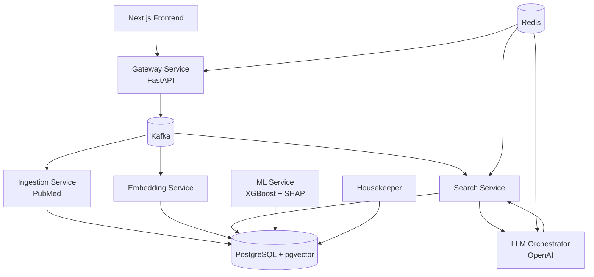

# NeuroAtlas AI Architecture

## 1. Vision

NeuroAtlas AI is a clinical decision support platform for pediatric neurorehabilitation.

The platform combines:

* Evidence Retrieval (RAG)
* Clinical Knowledge Base
* Outcome Prediction (ML)
* Explainable AI

Initial clinical focus:

* Pediatric Hemiparesis
* Hemiplegic Cerebral Palsy (Unilateral CP)
* Pediatric Neurorehabilitation

Long-term goal:

Build an evidence-based AI assistant that helps clinicians access scientific literature, analyze patient data, and eventually support outcome prediction.

---

## 2. Core Principles

The platform must:

* Remain evidence-based
* Never hallucinate scientific evidence
* Always provide citations
* Explain ML predictions
* Support future clinical research
* Follow clean architecture principles
* Remain modular and scalable

---

## 3. High-Level Architecture

```text
                                        ┌──────────────────────────────┐
                                        │        Web App (UI)          │
                                        │      Next.js / React         │
                                        └───────────────┬──────────────┘
                                                        │ HTTPS / JSON
                                        ┌───────────────▼──────────────┐
                                        │      API Gateway             │
                                        │          FastAPI             │
                                        │ auth · validation · audit    │
                                        └───────────────┬──────────────┘
                                                        │
                                          Request / Events
                                                        │
                                        ┌───────────────▼──────────────┐
                                        │           Kafka              │
                                        │      Event Backbone          │
                                        └──────┬────────┬────────┬─────┘
                                               │        │        │
                    ┌──────────────────────────┘        │        └─────────────────────────┐
                    │                                   │                                  │
                    ▼                                   ▼                                  ▼

        ┌──────────────────────┐      ┌──────────────────────┐      ┌──────────────────────┐
        │   Ingestion Service  │      │  Embedding Service   │      │    Search Service    │
        │      PubMed          │      │ Embedding Pipeline   │      │ Semantic Retrieval   │
        │ Guidelines Import    │      │ OpenAI / BGE Models  │      │ Similarity Search    │
        │ Metadata Extraction  │      │ Vector Generation    │      │ Context Assembly     │
        └──────────┬───────────┘      └──────────┬───────────┘      └──────────┬───────────┘
                   │                             │                             │
                   └──────────────┬──────────────┴──────────────┬──────────────┘
                                  │                             │
                                  ▼                             ▼

                    ┌────────────────────────────────────────────────────┐
                    │            PostgreSQL + pgvector                  │
                    │                                                    │
                    │ Articles                                           │
                    │ Chunks                                             │
                    │ Embeddings                                         │
                    │ Clinical Metadata                                  │
                    │ Future Feature Store                               │
                    └───────────────────────┬────────────────────────────┘
                                            │
                                            │ Retrieved Context
                                            ▼

                            ┌─────────────────────────────────┐
                            │      LLM Orchestrator          │
                            │        LlamaIndex             │
                            │      Prompt Builder           │
                            │      Citation Engine          │
                            └───────────────┬───────────────┘
                                            │
                                            ▼

                            ┌─────────────────────────────────┐
                            │         LLM Provider           │
                            │ OpenAI / Anthropic / vLLM      │
                            └─────────────────────────────────┘


 ┌──────────────────────┐                                 ┌──────────────────────┐
 │      Redis           │                                 │    Housekeeper       │
 │ Response Cache       │                                 │ Alembic Migrations   │
 │ Session Storage      │                                 │ Schema Management    │
 │ Rate Limiting        │                                 │ DB Health Checks     │
 │ Temporary State      │                                 │ Query Monitoring     │
 └──────────┬───────────┘                                 └──────────┬───────────┘
            │                                                      │
            └──────────────────────────┬───────────────────────────┘
                                       │
                                       ▼

                    ┌────────────────────────────────────┐
                    │         ML Service                 │
                    │      XGBoost + SHAP                │
                    │ Outcome Prediction Engine          │
                    │ (Future Phase)                     │
                    └────────────────────────────────────┘
```

---

## 4. Service Responsibilities

### Gateway Service

Responsibilities:

* REST API
* Authentication
* Authorization
* Validation
* Audit Logging
* Rate Limiting
* Publishing Kafka Events

Technology:

* FastAPI

---

### Ingestion Service

Responsibilities:

* PubMed Search
* Article Retrieval
* Metadata Extraction
* Full Text Processing
* Chunk Generation

Outputs:

* ArticleImported Event

Future Sources:

* Clinical Guidelines
* Registries
* Institutional Knowledge Bases

---

### Embedding Service

Responsibilities:

* Embedding Generation
* Embedding Updates
* Vector Storage
* Embedding Versioning

Technology:

* OpenAI Embeddings
* BGE Models
* Sentence Transformers

Outputs:

* EmbeddingsGenerated Event

---

### Search Service

Responsibilities:

* Similarity Search
* Context Retrieval
* Ranking
* Metadata Filtering

Technology:

* pgvector

Outputs:

* SearchCompleted Event

---

### LLM Orchestrator

Responsibilities:

* RAG Context Assembly
* Prompt Building
* LLM Communication
* Citation Generation
* Response Formatting

Technology:

* LlamaIndex
* OpenAI SDK

Future:

* Anthropic
* Self-hosted vLLM

---

### ML Service

Responsibilities:

* Outcome Prediction
* Clinical Feature Analysis
* Explainable AI

Features:

* Age
* GMFCS
* MACS
* Ashworth
* Goniometry
* Therapy Type

Potential Targets:

* Functional Improvement
* MACS Improvement
* GMFCS Improvement
* Reduction in Spasticity

Technology:

* XGBoost
* SHAP

Status:

Future Phase (Not MVP)

---

### Housekeeper Service

Responsibilities:

* Database Migrations
* Alembic Management
* PostgreSQL Maintenance
* Schema Evolution
* Long Query Monitoring
* Database Health Checks

The Housekeeper service is the single authority responsible for database lifecycle management.

All migrations must be executed through Housekeeper.

This service follows the same philosophy used in PaymentGate.

---

## 5. Infrastructure

### PostgreSQL + pgvector

Primary storage layer.

Stores:

* Articles
* Chunks
* Embeddings
* Metadata
* Future Clinical Features

Technology:

* PostgreSQL 17
* pgvector

---

### Kafka

Responsible for event-driven communication between services.

Topics:

```text
article-import-requested
article-imported

embeddings-requested
embeddings-generated

search-requested
search-completed

prediction-requested
prediction-completed
```

Benefits:

* Loose coupling
* Scalability
* Event replay
* Async processing

---

### Redis

Responsibilities:

* Response Caching
* Session Storage
* Rate Limiting
* Temporary State Management

Future:

* Task Queues
* Background Jobs
* Distributed Locks

---

## 6. Kafka Event Flow

```text
article-import-requested
        ↓
Ingestion Service
        ↓
article-imported
        ↓
Embedding Service
        ↓
embeddings-generated
        ↓
Search Service


search-requested
        ↓
Search Service
        ↓
context-generated
        ↓
LLM Orchestrator
        ↓
answer-generated


prediction-requested
        ↓
ML Service
        ↓
prediction-completed
```

---

## 7. MVP Scope

Included:

* PubMed Integration
* Article Ingestion
* Chunking
* Embeddings
* pgvector
* Semantic Search
* Retrieval
* RAG
* Citations
* REST API
* Docker Deployment
* Kafka Event Pipeline
* Redis Cache

Excluded:

* Outcome Prediction
* SHAP Explanations
* Clinical Recommendations
* Multi-Tenant Support

---

## 8. Technology Stack

### Backend

* Python 3.13
* FastAPI
* SQLAlchemy 2.0
* Alembic

### Database

* PostgreSQL 17
* pgvector

### AI

* OpenAI
* LlamaIndex
* Sentence Transformers

### Messaging

* Kafka

### Caching

* Redis

### Infrastructure

* Docker
* Docker Compose

### Quality

* Pytest
* Ruff
* MyPy

---

## 9. Development Roadmap

### Phase 1

Infrastructure

```text
Docker
PostgreSQL
pgvector
Kafka
Redis
FastAPI
```

### Phase 2

Knowledge Base

```text
PubMed
↓
Article Storage
↓
Chunking
```

### Phase 3

Embeddings

```text
Chunks
↓
Embeddings
↓
pgvector
```

### Phase 4

RAG

```text
Search
↓
Retrieval
↓
LLM
↓
Answer + Sources
```

### Phase 5

Frontend

```text
Next.js
↓
Gateway
↓
RAG API
```

### Phase 6

Machine Learning

```text
Clinical Features
↓
XGBoost
↓
SHAP
↓
Outcome Prediction
```

---

## 10. Long-Term Vision

```text
Scientific Literature
        +
Clinical Knowledge
        +
Machine Learning
        +
Explainable AI

                ↓

         NeuroAtlas AI

                ↓

Evidence-Based Clinical
Decision Support Platform
for Pediatric Neurorehabilitation
```

## System Architecture


