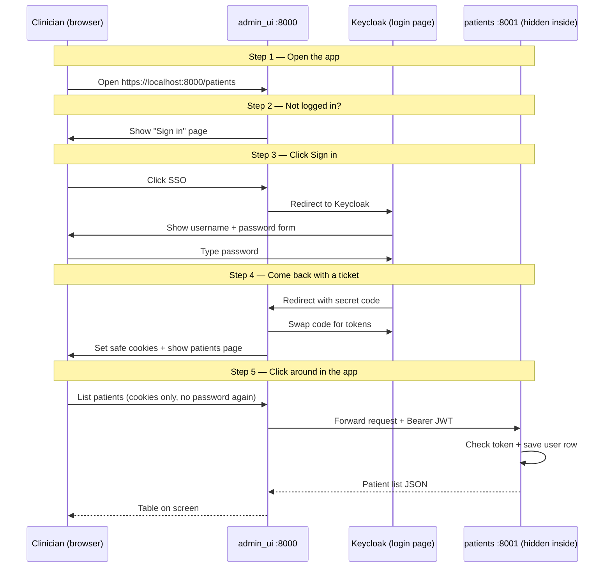

# Admin UI Browser Login Flow

Clinician login through **`admin_ui`** (port 8000): Keycloak OIDC, session cookies, guard proxy
to `patients`. No AtomID token exchange — the same Keycloak JWT is forwarded to backends.

**Jira:** NLS-ADMIN-02 (NLS-62) · NLS-ADMIN-03..08 (NLS-63..68) · **Scaffold:** NLS-ADMIN-01 (NLS-61)

Keycloak client **`neuroatlas-ui`** (public, PKCE) redirects to `http://localhost:8000/api/v1/token`
after login — configured in `infra/keycloak/import/neuroatlas-realm.json`.

See also [edge architecture](./edge-architecture.md) for module layout and [cookie request flow](./auth-admin-ui-cookie-request-flow.md) for session/guard mechanics.

## HTTP routes

| Route | Purpose |
|-------|---------|
| `GET /api/v1/auth` | Start OIDC redirect |
| `GET /api/v1/token` | Exchange code; set cookies |
| `POST /api/v1/token/refresh` | Refresh session |
| `POST /api/v1/logout` | Clear cookies |
| `GET /api/v1/auth/me` | Current user + roles |
| `/guard/api/v1/*` | Proxy to patients / ml / housekeeper |

Detail: [cookie request flow](./auth-admin-ui-cookie-request-flow.md).

## Related diagrams

- [Cookie session request flow](./auth-admin-ui-cookie-request-flow.md)
- [Authenticated request flow (backend)](./auth-request-flow.md)
- [JIT user upsert](./auth-jit-upsert.md)
- [API Gateway client flow](./auth-api-gateway-flow.md) (non-browser clients)
