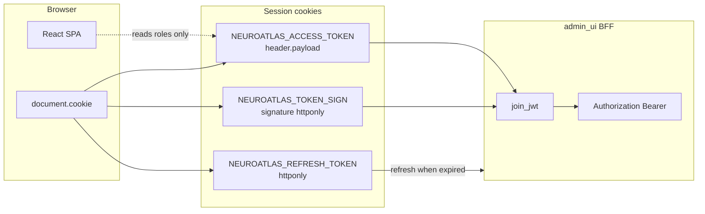
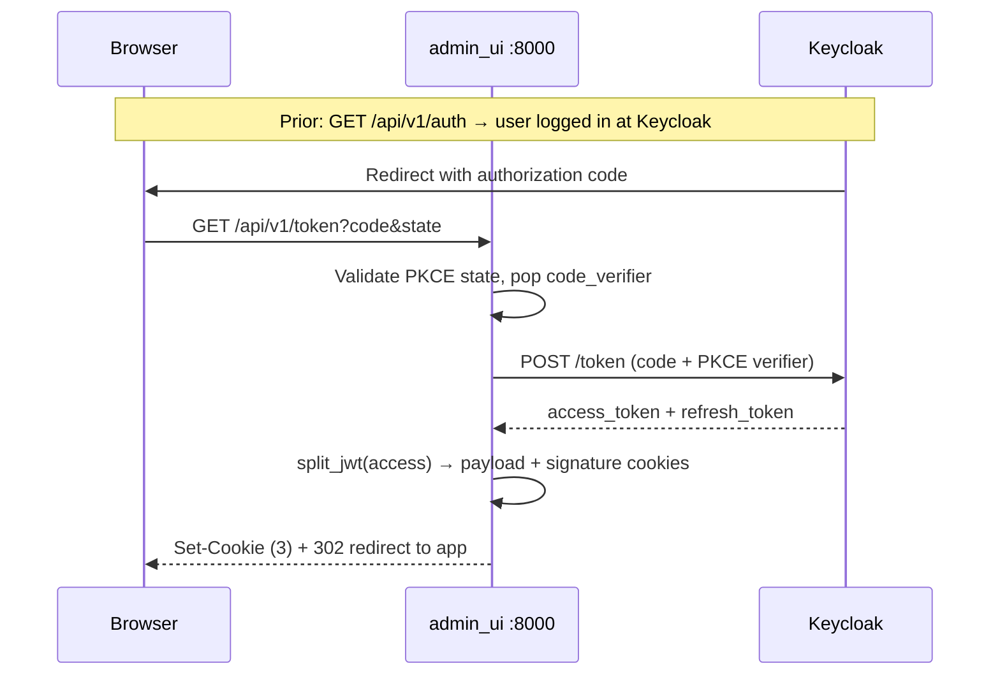
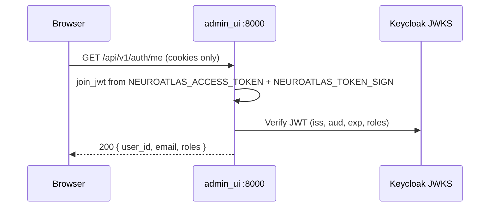
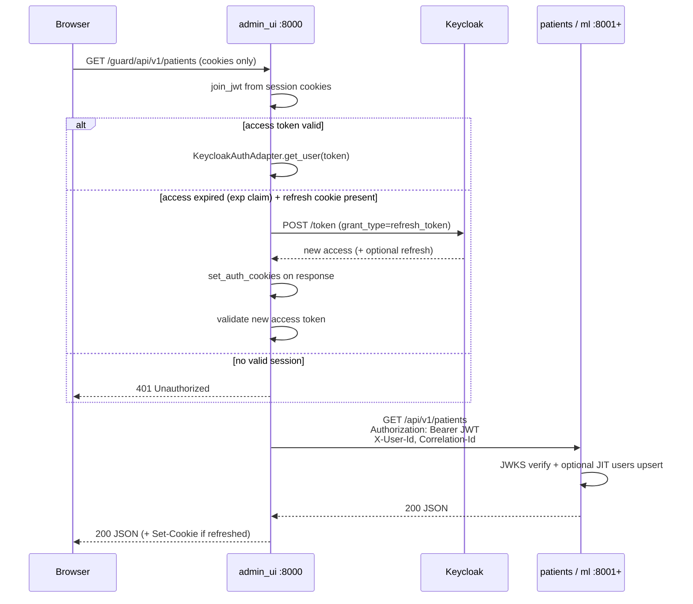
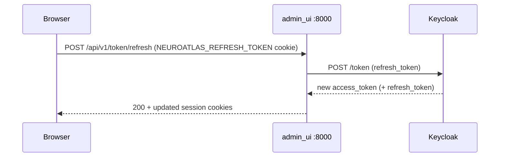
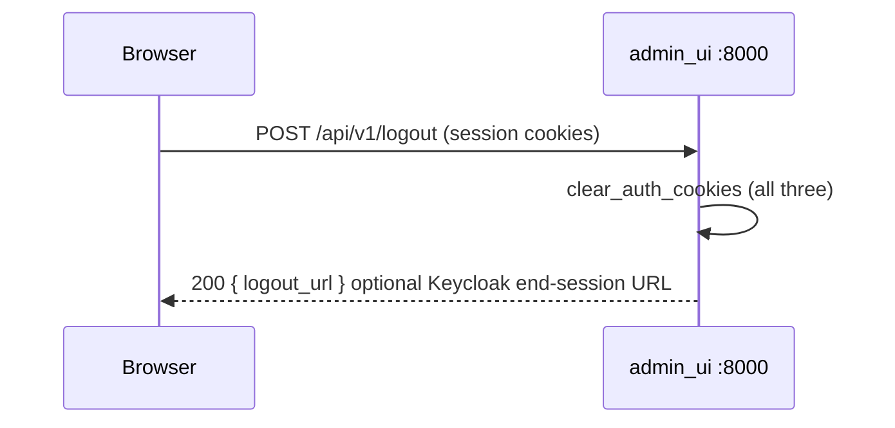
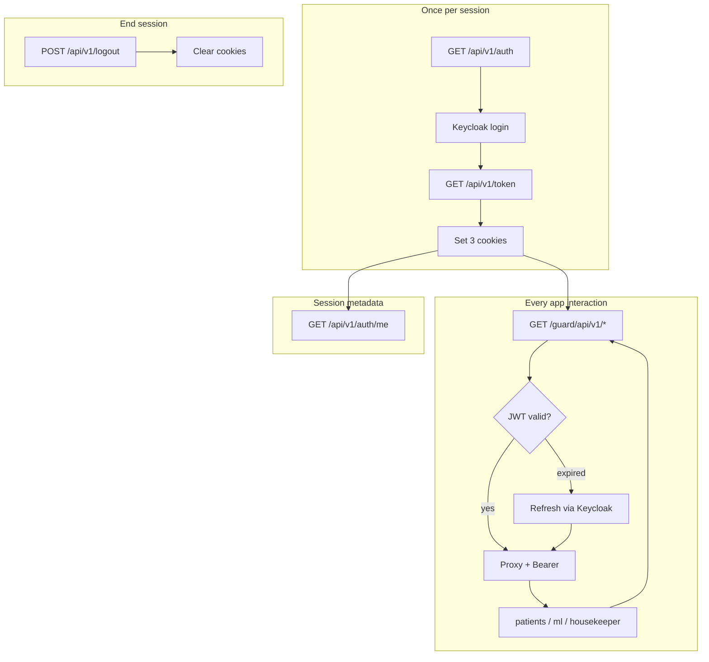

# Admin UI Cookie Session — Request Flow

How **`admin_ui`** (:8000) uses **HTTP cookies** for browser sessions: split JWT storage,
refresh handling, and guard proxy forwarding. The browser never sends `Authorization: Bearer`
to backend services directly — only `admin_ui` does, after reconstructing the Keycloak access
token from cookies.

**Jira:** NLS-ADMIN-03 (NLS-63) auth handlers · NLS-ADMIN-04 (NLS-64) guard proxy

For the high-level login story, see [Admin UI browser login flow](./auth-admin-ui-browser-flow.md).
For JWT validation inside `patients` / `ml`, see [Authenticated request flow (backend)](./auth-request-flow.md).

---

## Cookie model

After OIDC login, `admin_ui` stores three cookies (names from `AdminUiSettings`):

| Cookie | Default name | httpOnly | Purpose |
|--------|--------------|----------|---------|
| Access payload | `NEUROATLAS_ACCESS_TOKEN` | No | JWT `header.payload` — readable by SPA for role hints |
| Access signature | `NEUROATLAS_TOKEN_SIGN` | Yes | JWT signature — cannot be forged without server read |
| Refresh token | `NEUROATLAS_REFRESH_TOKEN` | Yes | Keycloak refresh token for silent session renewal |

The full access JWT is rebuilt server-side: `header.payload` + `.` + `signature`.

**Why split?** PaymentGate-style UX: the SPA can read claims from the payload cookie (e.g.
`realm_access.roles`) without holding a forgeable full JWT. The signature stays httpOnly.

**Flags:** `Path=/`, `SameSite=Lax`, `Secure` when `ENVIRONMENT != local`. Logout clears cookies with the same attributes.

**Post-login redirect:** `?redirect=` on `GET /api/v1/auth` must be a relative path (`/patients`). External URLs are rejected (`sanitize_redirect_path` → `/`).

---

## Route families

| Prefix | Auth mechanism | Example |
|--------|----------------|---------|
| `/api/v1/auth*` | OIDC + cookies | Login, callback, `/auth/me`, refresh, logout |
| `/guard/api/v1/*` | Session cookies → Bearer forward | `GET /guard/api/v1/patients` |
| `/health` | None | Public health check |

---

## 1. Establish session (login callback)

Triggered after Keycloak redirects to `GET /api/v1/token?code=…&state=…`.

**Sets:** all three session cookies. **Does not** return tokens in the JSON body.

---

## 2. Read current user (`/auth/me`)

No Bearer header from the browser. Used by React `AuthProvider` to gate routes.

---

## 3. Guard proxy — general API request (main app flow)

Every data call from the SPA uses `/guard/...`. This is the **default request flow** after login.

**Path rewrite examples:**

| Guard request | Upstream |
|---------------|----------|
| `/guard/api/v1/patients` | `{PATIENTS_ROUTE}/api/v1/patients` |
| `/guard/api/v1/ml/predict` | `{ML_ROUTE}/api/v1/predict` |
| `/guard/api/v1/housekeeper/db/health` | `{HOUSEKEEPER_ROUTE}/api/v1/db/health` |

Configured via `service_map` in `src/admin_ui/settings.py`.

---

## 4. Explicit refresh (`POST /api/v1/token/refresh`)

The SPA may call this on `401` before retrying (see NLS-ADMIN-05 `HttpAuthBase` pattern).

Guard proxy can also refresh **implicitly** (section 3) without this call.

---

## 5. Logout

---

## End-to-end overview

---

## What the browser never does

| Avoided | Reason |
|---------|--------|
| Call `patients:8001` directly | Backends internal; CORS and token exposure |
| Store refresh token in JS | httpOnly cookie only |
| Send full JWT in `Authorization` from SPA | BFF reconstructs and forwards server-side |
| AtomID / token exchange | Same Keycloak JWT end-to-end ([comparison](./auth-paymentgate-comparison.md)) |

---

## Code references

| Concern | Module |
|---------|--------|
| Cookie set/clear/join | `src/admin_ui/adapters/http/dependencies.py` |
| JWT split/join, PKCE | `src/admin_ui/auth/session.py` |
| Auth routes | `src/admin_ui/adapters/http/auth.py` |
| Guard proxy | `src/admin_ui/adapters/http/proxy_handlers.py` |
| Upstream URL map | `src/admin_ui/adapters/http/proxy.py`, `settings.service_map` |

---

## Related diagrams

- [Admin UI browser login flow](./auth-admin-ui-browser-flow.md) — clinician journey
- [Edge architecture](./edge-architecture.md) — admin_ui vs gateway
- [Authentication architecture](./auth-architecture.md) — component map
- [Authenticated request flow (backend)](./auth-request-flow.md) — inside patients/ml
- [JIT user upsert](./auth-jit-upsert.md) — first proxied call creates `users` row
