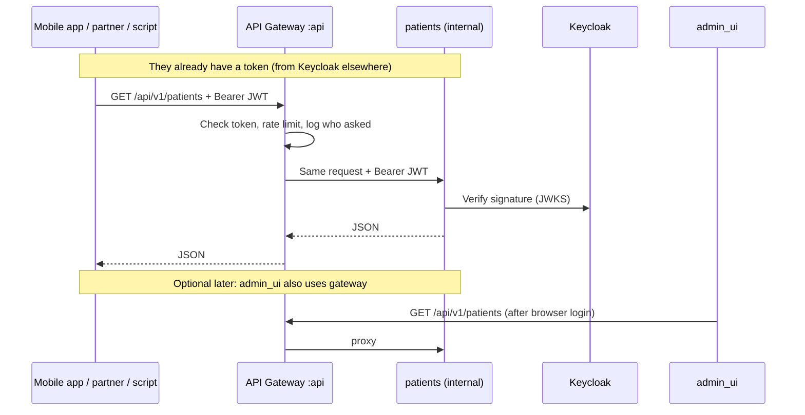

# API Gateway Client Flow

Headless **gateway** service for **all non-browser API clients** (mobile, partners, scripts).
Validates Keycloak JWT at the edge, applies rate limiting and audit (planned), proxies to
internal services.

**Jira:** NLS-50..51, NLS-101..104 · **Status:** Planned (post-Pioneer)

Browser clinicians use [**admin_ui**](./auth-admin-ui-browser-flow.md) instead.

## Gateway vs admin_ui

| | admin_ui | gateway |
|--|----------|---------|
| **Users** | Clinicians (browser) | Mobile, partners, automation |
| **UI** | React SPA embedded | None |
| **Login** | Keycloak OIDC + cookies | Bearer JWT only (client obtains token separately) |
| **When** | Pioneer (NLS-61..69) | Post-Pioneer |

## Related diagrams

- [Edge architecture](./edge-architecture.md)
- [Authentication architecture](./auth-architecture.md)
- [PaymentGate comparison](./auth-paymentgate-comparison.md)
