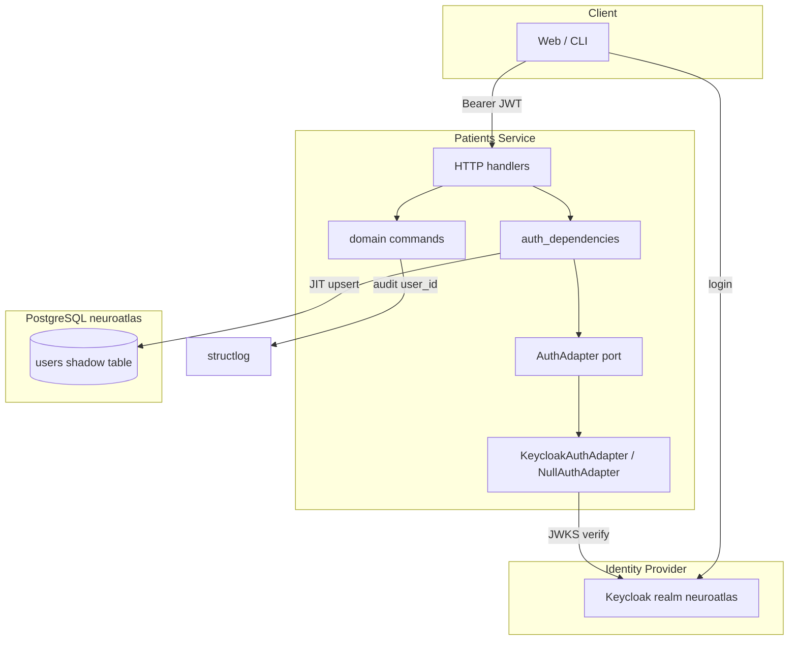

# Authentication Architecture

NeuroAtlas uses **OpenID Connect (OIDC) access tokens in JWT format**, validated at the
API boundary. **Keycloak** is the default identity provider for local, staging, and
production. Domain code depends on the `AuthAdapter` port only — swapping IdPs does not
touch handlers or commands.

## Module layout

| Module | Layer | Purpose |
|--------|-------|---------|
| `common/core/ports/auth.py` | Port | `AuthAdapter` ABC |
| `common/adapters/auth/keycloak.py` | Adapter | JWKS validation, role extraction |
| `common/adapters/http/auth_dependencies.py` | Adapter | FastAPI `Depends` |
| `common/core/entities/user.py` | Domain entity | `UserInfo` (no PHI) |
| `common/adapters/database/models/user.py` | Adapter | Shadow `users` ORM |

## Related diagrams

- [Request flow](./auth-request-flow.md)
- [Keycloak user registration (admin)](./auth-keycloak-user-registration.md)
- [Users schema](./auth-users-schema.md)
- [JIT upsert](./auth-jit-upsert.md)
- [PaymentGate comparison](./auth-paymentgate-comparison.md)
