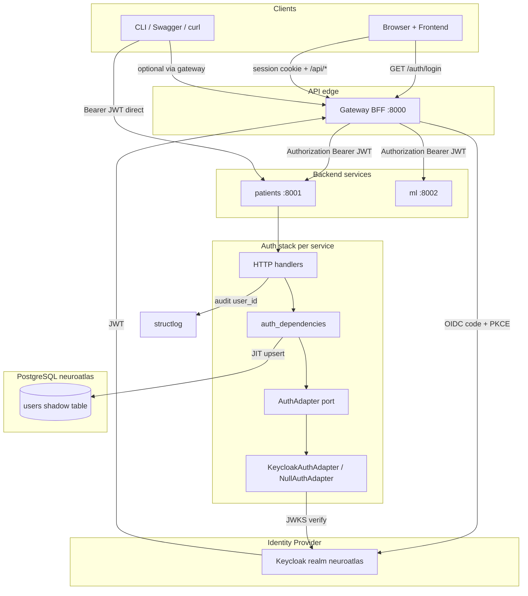

# Authentication Architecture

NeuroAtlas uses **OpenID Connect (OIDC) access tokens in JWT format**, validated at the
API boundary. **Keycloak** is the default identity provider. Domain code depends on the
`AuthAdapter` port only — swapping IdPs does not touch handlers or commands.

**Target entry point (Pioneer / M2):** browser and frontend call the **Gateway BFF**, which
holds the OIDC session and forwards the Keycloak JWT to backends. See
[Browser login via gateway](./auth-browser-gateway-flow.md).

## Flow summary

| Path | Client | Token at backend | Status |
|------|--------|------------------|--------|
| **Browser / UI** | Frontend → Gateway | Keycloak JWT (forwarded by gateway) | Pioneer target (NLS-GW-*) |
| **Direct API** | curl / Swagger → patients | Keycloak JWT in `Authorization` header | Supported today (dev smoke) |
| **Auth disabled** | Any | `NullAuthAdapter` dev user | Local tests (`AUTH_ENABLED=false`) |

## Module layout

| Module | Layer | Purpose |
|--------|-------|---------|
| `common/core/ports/auth.py` | Port | `AuthAdapter` ABC |
| `common/adapters/auth/keycloak.py` | Adapter | JWKS validation, role extraction |
| `common/adapters/http/auth_dependencies.py` | Adapter | FastAPI `Depends`, Swagger `HTTPBearer` |
| `common/core/entities/user.py` | Domain entity | `UserInfo` (no PHI) |
| `common/adapters/database/models/user.py` | Adapter | Shadow `users` ORM |
| `src/gateway/` (planned) | Adapter | OIDC BFF, session, reverse proxy |

## Related diagrams

- [Browser login via gateway](./auth-browser-gateway-flow.md) — **target Pioneer flow**
- [Authenticated request flow (backend)](./auth-request-flow.md)
- [Keycloak user registration (admin)](./auth-keycloak-user-registration.md)
- [Users schema](./auth-users-schema.md)
- [JIT upsert](./auth-jit-upsert.md)
- [PaymentGate comparison](./auth-paymentgate-comparison.md)
