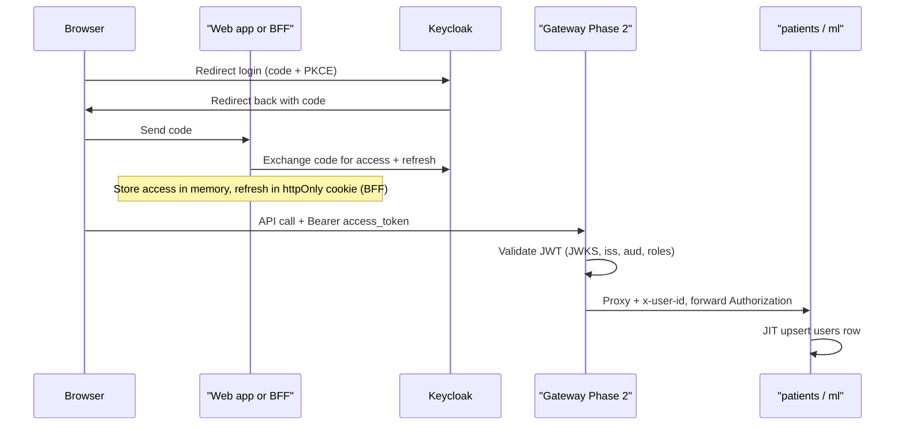
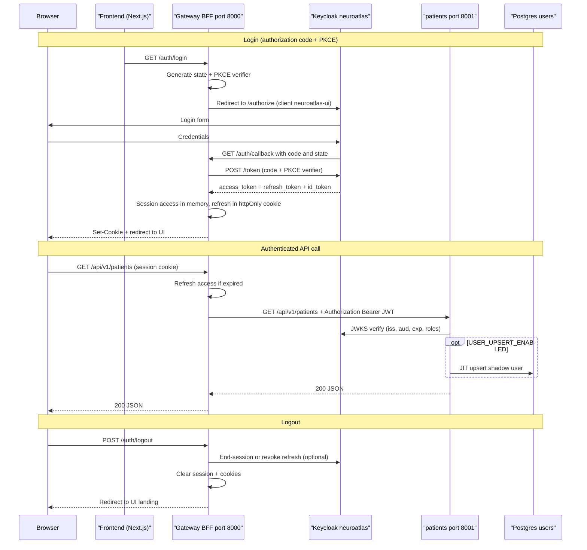

# Browser Login via Gateway (Target Flow)

> **Superseded for browser (Pioneer):** clinicians use **`admin_ui`** on port 8000 — see
> [Admin UI browser login flow](./auth-admin-ui-browser-flow.md). This document remains for the
> legacy gateway BFF design and post-Pioneer headless **gateway** planning.

NeuroAtlas **Pioneer / M2** auth path: the browser never holds a long-lived access token in
JavaScript. The **Gateway BFF** runs the OIDC authorization-code flow with **PKCE**, stores the
refresh token in an **httpOnly cookie**, and forwards the **same Keycloak access JWT** to backend
services as `Authorization: Bearer`.

> **Not PaymentGate:** there is **no** Keycloak → AtomID token exchange. Gateway and backends
> validate the **Keycloak JWT** directly. See [PaymentGate comparison](./auth-paymentgate-comparison.md).

## Phase 2: UI login + gateway edge validation

The web app (or a dedicated BFF) completes the OIDC code exchange. The browser sends the
**access token** to the gateway on API calls; the gateway **validates the JWT at the edge**
(JWKS, `iss`, `aud`, roles), then proxies to backend services with `Authorization` forwarded
and optional `x-user-id` injection. Backends still run JIT upsert on first authenticated request.

| Step | Responsibility |
|------|----------------|
| OIDC login + token exchange | Web app or BFF (`neuroatlas-ui` client) |
| JWT validation at edge | Gateway (Phase 2) |
| Business auth + JIT upsert | Backend service (`patients`, `ml`) |

## Unified BFF (cookie session)

Alternative Pioneer layout: the **gateway owns** `/auth/login` and `/auth/callback`; the browser
uses a **session cookie** instead of sending Bearer from the client. Gateway refreshes access
tokens server-side before proxying.

## End-to-end sequence (unified BFF)

## Components

| Component | Port (local) | Role |
|-----------|--------------|------|
| Frontend | 3000 (dev) | Triggers `/auth/login`; calls API only via gateway base URL |
| Gateway BFF | 8000 | OIDC routes, session, reverse proxy to backends |
| Keycloak | 8080 | IdP; realm `neuroatlas`; clients `neuroatlas-ui` (browser) + `neuroatlas-api` (resource) |
| patients | 8001 | Validates forwarded JWT; JIT upsert; business logic |

## Keycloak clients

| Client | Type | Purpose |
|--------|------|---------|
| `neuroatlas-ui` | Public (PKCE) | Browser redirect URIs → gateway `/auth/callback` |
| `neuroatlas-api` | Confidential | Audience for API JWTs (`aud` includes `neuroatlas-api`) |

Admin-provisioned users still log in through Keycloak — see
[Keycloak user registration](./auth-keycloak-user-registration.md).

## Gateway routes (planned)

| Route | Purpose |
|-------|---------|
| `GET /auth/login` | Start OIDC redirect |
| `GET /auth/callback` | Exchange code; establish session |
| `POST /auth/logout` | Clear session; optional Keycloak logout |
| `/api/v1/patients*` | Reverse proxy → patients service |
| `/api/v1/ml*` | Reverse proxy → ml service (future) |

## Backend validation (unchanged)

Once the JWT reaches patients, validation matches the direct path documented in
[Authenticated request flow](./auth-request-flow.md) and [JIT upsert](./auth-jit-upsert.md).

## Local development modes

| Mode | How to authenticate | Use when |
|------|---------------------|----------|
| **Gateway + browser** (target) | Login via gateway; cookie session | E2E UI, Pioneer DoD |
| **Direct Bearer** (today) | `curl` / Swagger Authorize with token from Keycloak token endpoint | Backend-only smoke, NLS-17 |
| **Auth off** | `AUTH_ENABLED=false` | Unit tests, quick handler checks |

## Related diagrams

- [Authentication architecture](./auth-architecture.md)
- [Authenticated request flow (backend)](./auth-request-flow.md)
- [JIT user upsert](./auth-jit-upsert.md)
- [PaymentGate comparison](./auth-paymentgate-comparison.md)
