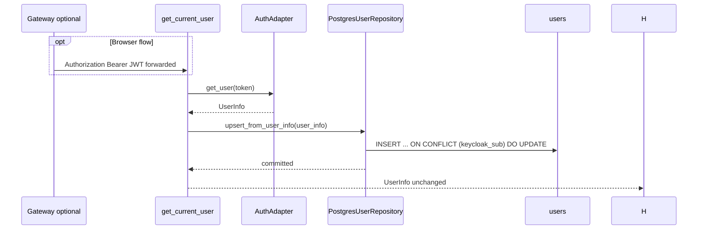

# JIT User Upsert

Just-in-time upsert runs **after** successful JWT validation in `get_current_user`.
It keeps the shadow `users` row in sync without a separate provisioning service.

In the **gateway browser flow**, the gateway forwards the same Keycloak JWT; upsert still
runs in the **backend service** (patients) on the first proxied authenticated request.

## Wiring

- Enabled when `AUTH_ENABLED=true` and `USER_UPSERT_ENABLED=true`
- Wired in `patients/lifespan.py` via `app.state.upsert_user`
- Uses a dedicated SQLAlchemy session (independent of the patients in-memory UoW)

## Failure handling

Upsert failures surface as adapter/infrastructure errors. Auth validation itself does
not depend on the database — a DB outage after token validation will fail the request
so operators notice persistence issues early.

## Related diagrams

- [Browser login via gateway](./auth-browser-gateway-flow.md)
- [Authenticated request flow](./auth-request-flow.md)
- [Shadow users schema](./auth-users-schema.md)
