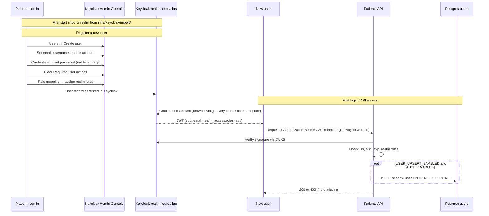

# Keycloak Admin: Register a New User

NeuroAtlas has **no in-app signup**. An administrator provisions identities in **Keycloak**;
the API validates JWTs and optionally **JIT-upserts** a shadow row in Postgres on the user's
first authenticated request (see [JIT upsert](./auth-jit-upsert.md)).

This document is the full sequence for **one-time realm setup** (if needed) and **registering
a new user** through the Keycloak Admin Console.



## Prerequisites

| Requirement | Local default |
|-------------|---------------|
| Keycloak running | `make up_infra` or `.\make.ps1 up_infra` (port **8080**) |
| Admin credentials | `KEYCLOAK_ADMIN` / `KEYCLOAK_ADMIN_PASSWORD` from `infra/.env` (default `admin` / `admin`) |
| Postgres + migrations | `make migrate` after infra is up |
| API auth enabled | `AUTH_ENABLED=true`, `USER_UPSERT_ENABLED=true` in `infra/.env` |
| OIDC settings | `OIDC_ISSUER`, `OIDC_JWKS_URL`, `OIDC_AUDIENCE=neuroatlas-api` |

Admin console URL: [http://localhost:8080/admin](http://localhost:8080/admin)

> **Important:** Keycloak data is stored in the Docker volume `keycloak_data`. If you see
> `{"error":"Realm does not exist"}`, the container was recreated **before** persistence was
> enabled, or the volume was deleted — run `.\make.ps1 up_infra` again (realm auto-imports on
> first start) and re-create users in Part 2 only.

---

## Part 1 — Realm, roles, and client (auto-imported locally)

On `make up_infra`, Keycloak imports `infra/keycloak/import/neuroatlas-realm.json`, which
creates:

| Resource | Value |
|----------|-------|
| Realm | `neuroatlas` |
| Realm roles | `admin`, `clinician`, `researcher` |
| OIDC client (API) | `neuroatlas-api` (confidential) |
| OIDC client (browser) | `neuroatlas-ui` (public, PKCE) — redirect to `admin_ui` `/api/v1/token` |
| Dev client secret | `dev-neuroatlas-api-secret` (set `KEYCLOAK_CLIENT_SECRET` in `infra/.env`) |
| Audience mapper | access token `aud` includes `neuroatlas-api` (both clients) |
| Direct access grants | ON for `neuroatlas-api` only (password grant for local curl tests) |

**You only need the manual steps below if** auto-import failed or you are on a remote Keycloak
without this compose file.

### 1.1 Create the realm (manual fallback)

1. Open the Admin Console and sign in.
2. Click the realm dropdown (top-left, usually **master**).
3. **Create realm** → name: `neuroatlas` → **Create**.

### 1.2 Create realm roles

NeuroAtlas reads roles from JWT claim **`realm_access.roles`** only — not client roles.

1. **Realm roles** → **Create role**.
2. Create each role (exact names):

| Role | Used by API today |
|------|-------------------|
| `clinician` | Required for patients write endpoints (`require_clinician`) |
| `admin` | Same access as clinician on patients API |
| `researcher` | Reserved for future read-only / search flows |

Default Keycloak roles such as `default-roles-neuroatlas`, `offline_access`, and
`uma_authorization` are ignored by the API adapter.

### 1.3 Create the OIDC client

1. **Clients** → **Create client**.
2. **General settings**
   - **Client type:** OpenID Connect
   - **Client ID:** `neuroatlas-api` (must match `OIDC_AUDIENCE` in `infra/.env`)
3. **Capability config**
   - **Client authentication:** ON (confidential client)
   - **Authorization:** OFF (unless you add UMA later)
   - **Authentication flow:** enable flows your clients need (e.g. **Standard flow** for a Web UI)
   - **Direct access grants:** ON for local token testing with username/password only (disable in production if unused)
4. **Save**, then open the **Credentials** tab and copy the **Client secret** (needed for the token endpoint in dev).

### 1.4 Audience mapper (required for API validation)

The patients service validates `aud` against `OIDC_AUDIENCE` (`neuroatlas-api`). Ensure the
access token includes that audience:

1. **Clients** → `neuroatlas-api` → **Client scopes** tab → open the dedicated scope
   (`neuroatlas-api-dedicated`).
2. **Add mapper** → **By configuration** → **Audience**.
3. **Included Client Audience:** `neuroatlas-api` → **Save**.

Without this mapper, tokens may carry `aud: account` and the API will reject them.

### 1.5 Browser client for admin_ui (auto-imported locally)

The **`neuroatlas-ui`** public client supports the admin_ui BFF authorization-code flow with
**PKCE** (NLS-ADMIN-02). Keycloak redirects back to admin_ui after login:

| Setting | Value |
|---------|-------|
| Client ID | `neuroatlas-ui` (matches `KEYCLOAK_UI_CLIENT_ID` in `infra/.env`) |
| Type | Public (no client secret) |
| Standard flow | ON |
| Direct access grants | OFF |
| PKCE | S256 (required) |
| Redirect URIs | `http://localhost:8000/api/v1/token`, `http://127.0.0.1:8000/api/v1/token`, `http://localhost:3000/*` |
| Web origins | `http://localhost:8000`, `http://127.0.0.1:8000`, `http://localhost:3000` |
| Audience mapper | access token `aud` includes `neuroatlas-api` |

Manual fallback: **Clients** → **Create client** → Client ID `neuroatlas-ui` → **Client
authentication** OFF → enable **Standard flow** only → set redirect URIs and web origins as
above → add the same **Audience** mapper (§1.4) on the client dedicated scope.

---

## Part 2 — Register a new user (admin workflow)

### 2.1 Create the user

1. Select realm **neuroatlas**.
2. **Users** → **Add user**.
3. Fill in:
   - **Username** (required)
   - **Email**
   - **Email verified:** ON (avoids “account not fully set up” on login)
   - **Enabled:** ON
4. **Create**.

### 2.2 Set credentials

1. Open the user → **Credentials** tab.
2. **Set password** → enter password twice.
3. **Temporary:** OFF (otherwise Keycloak forces a password change before API access).
4. **Save**.

### 2.3 Clear required actions

1. **Details** tab → **Required user actions** → remove any pending actions
   (e.g. *Update Password*, *Verify Email*).
2. **Save**.

If this step is skipped, the token endpoint may return `Account is not fully set up`.

### 2.4 Assign realm roles

1. **Role mapping** tab → **Assign role**.
2. Filter by **Filter by realm roles**.
3. Select **`clinician`** and/or **`admin`** (and `researcher` if applicable) → **Assign**.

Do **not** assign roles only under **Clients** → `neuroatlas-api` → **Roles**; the API does
not read client roles.

### 2.5 Confirm (optional)

**Sessions** tab stays empty until the user logs in or requests a token.

---

## Part 3 — User obtains a token (verification)

For local CLI testing, use the resource-owner password grant against the realm token endpoint.
Replace placeholders; use `--data-urlencode` so special characters in the password are not mangled
by the shell.

```bash
curl -s -X POST "http://localhost:8080/realms/neuroatlas/protocol/openid-connect/token" \
  -H "Content-Type: application/x-www-form-urlencoded" \
  --data-urlencode "grant_type=password" \
  --data-urlencode "client_id=neuroatlas-api" \
  --data-urlencode "client_secret=<CLIENT_SECRET>" \
  --data-urlencode "username=<USERNAME>" \
  --data-urlencode "password=<PASSWORD>"
```

On Windows PowerShell, prefer the same flags or store credentials in variables — do not paste
unquoted `$` or `&` in passwords.

Decode the JWT at [jwt.io](https://jwt.io) and confirm:

| Claim | Expected |
|-------|----------|
| `iss` | `http://localhost:8080/realms/neuroatlas` |
| `aud` | includes `neuroatlas-api` |
| `sub` | stable UUID for this user |
| `email` or `preferred_username` | present |
| `realm_access.roles` | includes `clinician` and/or `admin` for patients API |

---

## Part 4 — First API call (JIT shadow user)

1. Start the patients service: `make run_patients` or `.\make.ps1 run_patients`.
2. Call a protected endpoint:

```bash
curl -s -H "Authorization: Bearer <ACCESS_TOKEN>" \
  http://localhost:8001/api/v1/patients
```

3. On success, verify the shadow row (optional):

```bash
docker exec -it postgres_neuroatlas psql -U neuroatlas -d neuroatlas \
  -c "SELECT id, keycloak_sub, email, display_name FROM users;"
```

The `id` column is `usr_{keycloak_sub}`; roles are **not** stored in Postgres — they remain in
the JWT on every request.

---

## Troubleshooting

| Symptom | Likely cause | Fix |
|---------|--------------|-----|
| `Realm does not exist` on token request | Keycloak container recreated without persisted volume; manual realm wiped | Run `.\make.ps1 up_infra` (imports realm); recreate users (Part 2); use client secret `dev-neuroatlas-api-secret` |
| `invalid_grant` / invalid credentials | Wrong password or shell mangled special chars | Reset password in Admin Console; use `--data-urlencode` |
| `Account is not fully set up` | Required actions or unverified email | Clear **Required user actions**; set **Email verified** ON |
| API `401` invalid token / audience | Token `aud` ≠ `OIDC_AUDIENCE` | Add **Audience** mapper (§1.4) |
| API `403` Requires one of: clinician, admin | Realm role not assigned | **Role mapping** → assign **realm** roles (§2.4) |
| No row in `users` table | Upsert disabled or auth off | Set `AUTH_ENABLED=true` and `USER_UPSERT_ENABLED=true`; run `make migrate` |

---

## Related diagrams

- [Authentication architecture](./auth-architecture.md)
- [Browser login via gateway](./auth-browser-gateway-flow.md)
- [Authenticated request flow](./auth-request-flow.md)
- [JIT user upsert](./auth-jit-upsert.md)
- [Shadow users schema](./auth-users-schema.md)

Automated realm bootstrap (replacing manual steps) is tracked as **NLS-301** in
[`docs/jira/plan.md`](../jira/plan.md).
