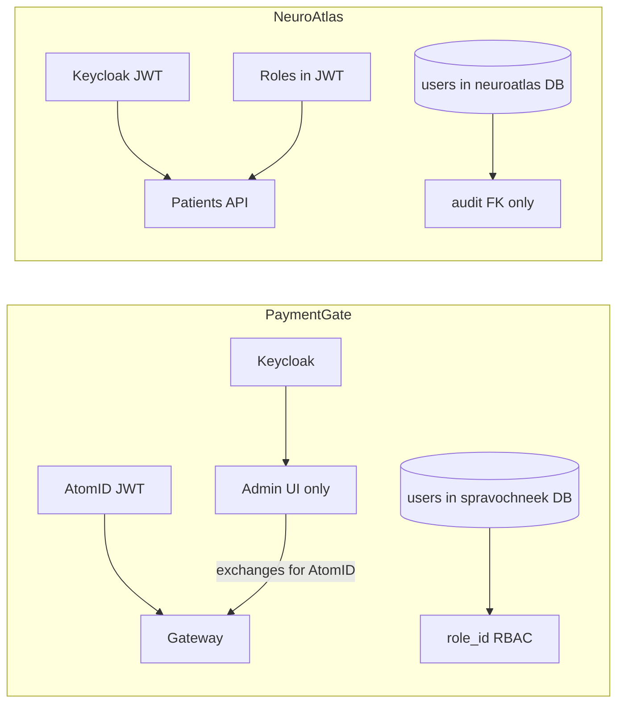

# PaymentGate vs NeuroAtlas Auth

PaymentGate and NeuroAtlas share the **hexagonal auth pattern** (`AuthAdapter`, JWKS,
FastAPI `Depends`) but differ in IdP layout and where users are persisted.

| Aspect | PaymentGate | NeuroAtlas |
|--------|-------------|------------|
| API identity | AtomID JWT (`ext_sub` → `usr_`) | Keycloak JWT (`sub` → `usr_`) |
| Admin identity | Keycloak (separate flow) | Same Keycloak realm (future UI) |
| `users` table location | `spravochneek` database | `neuroatlas` database |
| `users` purpose | Admin RBAC (`role_id` FK) | Shadow record + audit |
| Roles source | Admin DB for UI; JWT for API | JWT only (`realm_access.roles`) |
| IdP count at API edge | One (AtomID) | One (Keycloak) |

See also: PaymentGate `UserORM` in `common/models/db_spravochneek.py` — connect pgAdmin
to the **`spravochneek`** database, not `payments`, to see that table.
