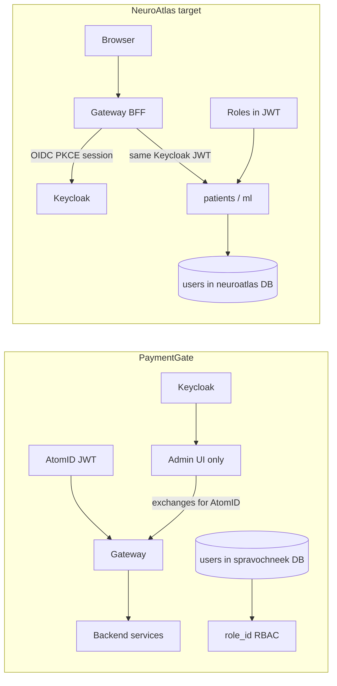

# PaymentGate vs NeuroAtlas Auth

PaymentGate and NeuroAtlas share the **hexagonal auth pattern** (`AuthAdapter`, JWKS,
FastAPI `Depends`) but differ in IdP layout, gateway token type, and where users are persisted.

| Aspect | PaymentGate | NeuroAtlas |
|--------|-------------|------------|
| API identity at edge | AtomID JWT (`ext_sub` → `usr_`) | Keycloak JWT (`sub` → `usr_`) |
| Browser login | Keycloak in admin UI → **token exchange** → AtomID session | Keycloak OIDC → **same JWT** forwarded by gateway |
| Admin identity | Keycloak (separate flow) | Same Keycloak realm (`neuroatlas`) |
| `users` table location | `spravochneek` database | `neuroatlas` database |
| `users` purpose | Admin RBAC (`role_id` FK) | Shadow record + audit |
| Roles source | Admin DB for UI; JWT for API | JWT only (`realm_access.roles`) |
| IdP count at API edge | One (AtomID) | One (Keycloak) |
| Gateway role | Validates AtomID; proxies to services | OIDC BFF + session; forwards Keycloak Bearer |

NeuroAtlas **direct-to-patients** Bearer auth (curl/Swagger) remains supported for dev;
production browser traffic is intended to go through the gateway only.

See [Browser login via gateway](./auth-browser-gateway-flow.md).

PaymentGate `UserORM` lives in `common/models/db_spravochneek.py` — connect pgAdmin
to the **`spravochneek`** database, not `payments`, to see that table.
