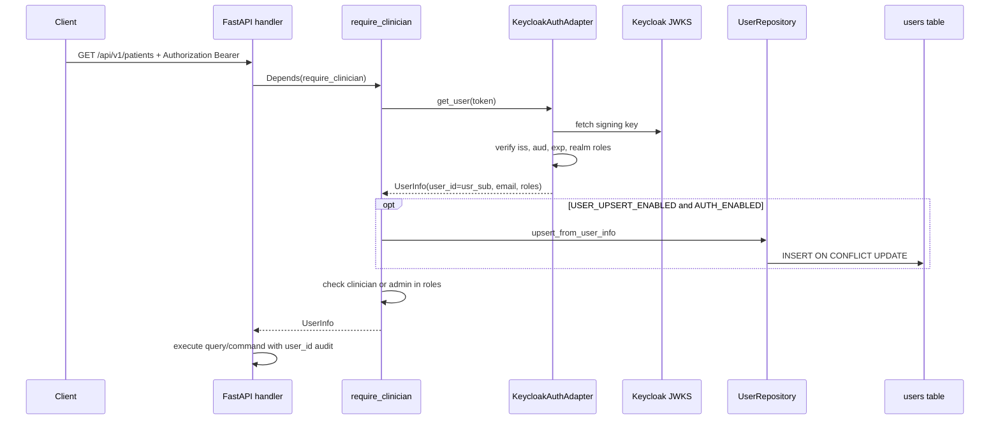

# Authentication Request Flow

Authenticated API requests follow this sequence. `/health` remains public.

## Local development

When `AUTH_ENABLED=false`, `NullAuthAdapter` returns a fixed dev user with
`clinician` and `admin` roles. No Keycloak or Postgres connection is required.
