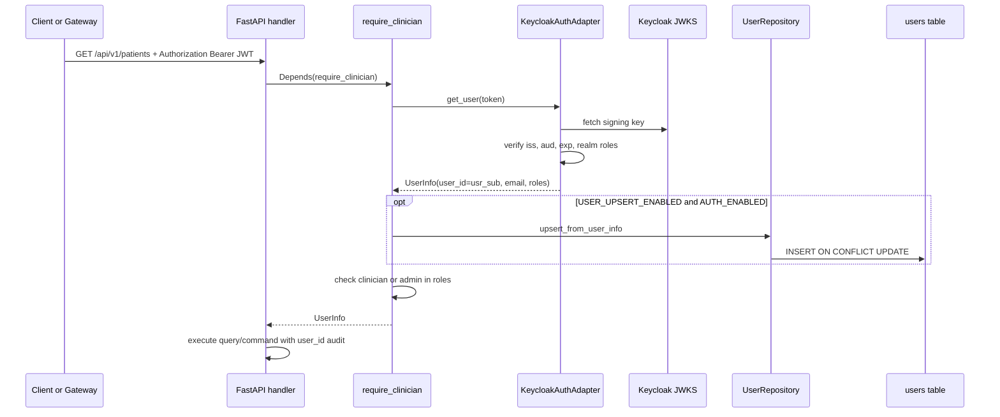

# Authenticated Request Flow (Backend)

This sequence runs **inside each backend service** (patients, ml, …) after a Keycloak JWT
arrives in the `Authorization` header. It is the same whether the client sent the token
**directly** (curl, Swagger) or the **gateway forwarded** it from a browser session.

For the browser login and proxy path, see [Browser login via gateway](./auth-browser-gateway-flow.md)
(including **Phase 2**: UI token exchange, gateway JWT validation, then proxy to backends).

`/health` remains public on every service.

## Who sends the Bearer token?

| Caller | Typical use |
|--------|-------------|
| **Gateway BFF** | Production browser flow; adds `Authorization` after session refresh |
| **curl / Postman** | Dev smoke: token from Keycloak token endpoint |
| **Swagger UI** | Dev smoke: **Authorize** with Bearer (requires `HTTPBearer` in dependencies) |

Obtaining a token via password grant is for **dev/scripts only** — not the browser UI path.

## Local development

When `AUTH_ENABLED=false`, `NullAuthAdapter` returns a fixed dev user with
`clinician` and `admin` roles. No Keycloak or Postgres connection is required.

## Related diagrams

- [Browser login via gateway](./auth-browser-gateway-flow.md)
- [JIT user upsert](./auth-jit-upsert.md)
- [Authentication architecture](./auth-architecture.md)
