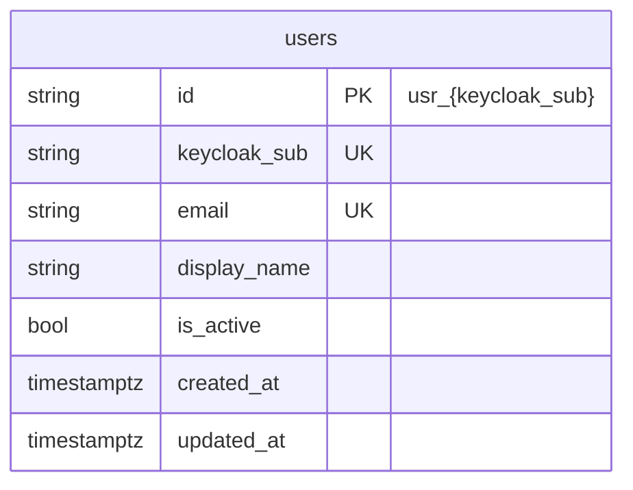

# Shadow Users Schema

The `users` table stores a **shadow copy** of Keycloak identity for audit FKs and
reporting. **Roles are not stored here** — they always come from the JWT at request time.

## Column mapping

| Column | Source |
|--------|--------|
| `id` | `prefixed_id("user", sub)` → `usr_{sub}` |
| `keycloak_sub` | JWT claim `sub` |
| `email` | JWT `email` or `preferred_username` |
| `display_name` | JWT `name` (optional, future) |
| `is_active` | default `true` |

Migration: `src/housekeeper/migrations/versions/0002_users.py`

Apply with: `make migrate`

## Related diagrams

- [Browser login via gateway](./auth-browser-gateway-flow.md)
- [JIT user upsert](./auth-jit-upsert.md)
- [Authentication architecture](./auth-architecture.md)
