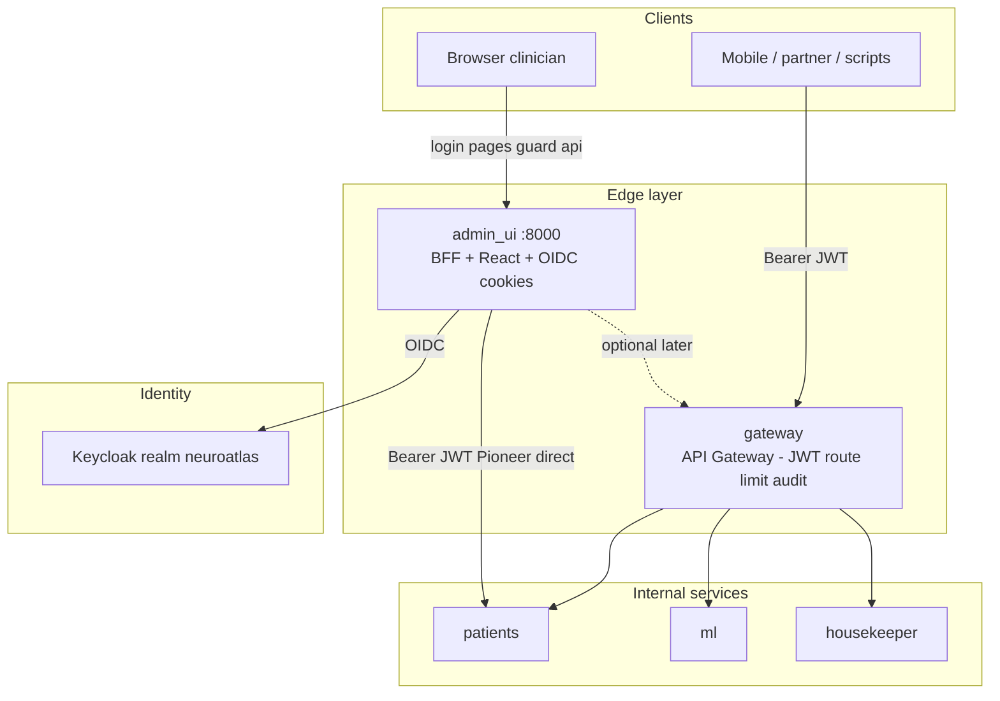

# Edge Architecture: admin_ui vs API Gateway

NeuroAtlas uses **two edge services** with different jobs (PaymentGate uses the same split).

| Service | Port (local) | Who uses it | Purpose |
|---------|--------------|-------------|---------|
| **admin_ui** | 8000 | Clinicians in a **browser** | Embedded React SPA, Keycloak OIDC login, session cookies, guard proxy to backends |
| **gateway** | TBD (e.g. 8088) | Mobile, partners, scripts, **all API clients** | Headless API Gateway: JWT validation, routing, rate limiting, audit |

Backends (`patients`, `ml`, `housekeeper`) stay **internal** — not exposed on the public internet in production.

## Target topology



## Implementation phases

| Phase | Service | Jira |
|-------|---------|------|
| **Pioneer (now)** | `admin_ui` scaffold + auth + React + proxy | NLS-ADMIN-01..09 (NLS-61..69) |
| **Post-Pioneer** | Headless `gateway` + rate limiting | NLS-50..51, NLS-101..104 |

## Target module layout (`src/admin_ui/`)

```
src/admin_ui/
├── main.py                    # auth_router, proxy_router, frontend_router (order matters)
├── lifespan.py                # httpx client, future keycloak client on app.state
├── settings.py                # cookie aliases, service_map, keycloak, static_path
├── Dockerfile
├── auth/                      # NLS-ADMIN-03
│   ├── keycloak.py            # OIDC: auth_url, token, refresh, validate
│   └── queries.py             # get_user_info from JWT claims + roles
├── adapters/http/             # NLS-ADMIN-03..06
│   ├── auth.py                # /api/v1/auth, /token, /logout, /auth/me
│   ├── proxy_handlers.py      # /guard/api/v1/* → patients/ml
│   ├── frontend.py            # SPA + window._env_ injection
│   └── dependencies.py        # cookie session → UserInfo
└── ui/                        # NLS-ADMIN-05
    └── src/
        ├── pages/auth/        # Login, Callback
        ├── pages/patients/    # MVP list
        └── shared/services/   # AuthService, HttpAuthBase
```

`src/gateway/` (headless) follows the same hexagonal layout without `ui/` or OIDC cookie routes.

## Architecture decisions

| Decision | Choice | Rationale |
|----------|--------|-----------|
| Browser entry | **admin_ui** on :8000 | PaymentGate-proven BFF + React pattern; one deployable for clinician UX |
| API entry for all clients | **gateway** (later) | microservices.io single HTTPS entry; mobile/partners never hit admin_ui |
| Token at backend | **Keycloak JWT** (no AtomID) | Simpler than PaymentGate; same token from login to patients |
| Pioneer proxy path | admin_ui → **patients direct** | Faster MVP; optional admin_ui → gateway → patients later |
| Session cookies | Split JWT cookies (planned) | Match PaymentGate UX; access payload readable, signature httponly |
| UI permissions | JWT `realm_access.roles` | No Spravochneek; menu filtered by clinician/admin/researcher |

## Related diagrams

- [Admin UI browser login flow](./auth-admin-ui-browser-flow.md)
- [Admin UI cookie request flow](./auth-admin-ui-cookie-request-flow.md)
- [API Gateway client flow](./auth-api-gateway-flow.md)
- [Authentication architecture](./auth-architecture.md)
- [PaymentGate comparison](./auth-paymentgate-comparison.md)
