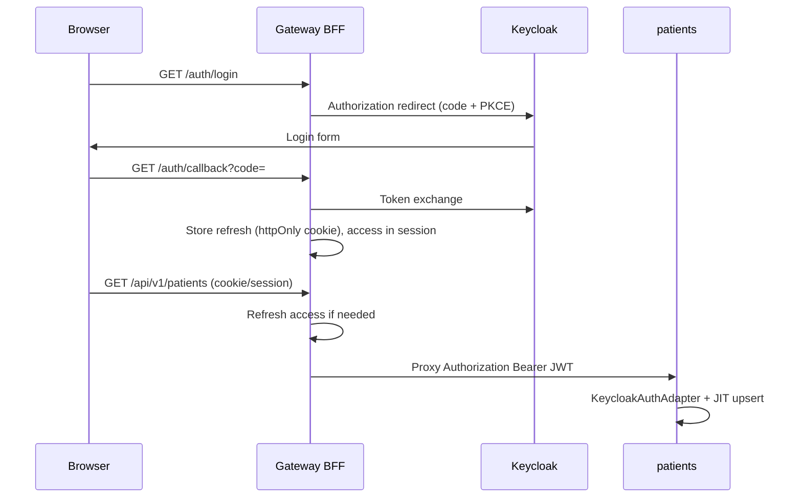

# Sprint 01 — Pioneer

**Milestones:** M1 (clinical API) + **M2 extension** (gateway + browser Keycloak auth)  
**Sprint goal:** Clinicians can log in via **browser**, gateway holds/refreshes the session, and proxied calls to **patients** (and later ml) use a real **Keycloak JWT** with JIT `users` upsert.

**Status:** **Active** in Jira (project key `NLS`) — sprint **Pioneer** (id 35).

> **Architecture note (vs PaymentGate):** NeuroAtlas does **not** exchange Keycloak → AtomID. The **same Keycloak access token** is validated at gateway and forwarded to backends. See [`auth-paymentgate-comparison.md`](../diagrams/auth-paymentgate-comparison.md).



---

## Sprint issues on the board

### M1 — Core (original 4)

| # | plan.md | Jira | Summary | Repo status |
|---|---------|------|---------|-------------|
| 1 | NLS-301 | NLS-14 | Keycloak realm bootstrap | **Partial** — `infra/keycloak/import/`, volume, doc |
| 2 | NLS-202 | NLS-15 | Alembic migrations | Open — `0002_users` done; patients tables TBD |
| 3 | NLS-201 | NLS-16 | Patients SQLAlchemy adapter | Partial — in-memory UoW today |
| 4 | NLS-302 | NLS-17 | JIT user upsert | **Partial** — wired; verify via Bearer to patients |

### M2 extension — Gateway + browser auth (add to Pioneer)

| # | plan ref | Jira | Summary | Epic | Depends on |
|---|----------|------|---------|------|------------|
| 5 | NLS-GW-01 | NLS-50 | Gateway scaffold (`src/gateway/`) | NLS-6 | — |
| 6 | NLS-GW-03 | NLS-52 | Keycloak browser client (`neuroatlas-ui`) | NLS-8 | NLS-14 |
| 7 | NLS-GW-02 | NLS-51 | Reverse proxy to backends | NLS-6 | NLS-50 |
| 8 | NLS-GW-04 | NLS-53 | OIDC login / callback / logout routes | NLS-6 | NLS-52, NLS-50 |
| 9 | NLS-GW-05 | NLS-54 | Session cookie + Bearer forwarding | NLS-6 | NLS-53 |
| 10 | NLS-GW-09 | NLS-58 | Docker compose gateway on stack | NLS-6 | NLS-51 |
| 11 | NLS-GW-06 | NLS-55 | E2E smoke via gateway | NLS-7 | NLS-54, NLS-17 |
| 12 | NLS-GW-07 | NLS-56 | Frontend browser login | NLS-13 | NLS-53 |
| 13 | NLS-GW-08 | NLS-57 | Frontend API via gateway only | NLS-13 | NLS-51, NLS-56 |
| 14 | NLS-GW-10 | NLS-59 | Auth diagram (gateway + browser) | NLS-8 | — |

Verify sprint membership:

```powershell
.\scripts\jira\jira_api.ps1 sprint-issues 35
```

---

## Acceptance criteria (by story)

### NLS-14 / NLS-301 — Keycloak realm bootstrap
- [ ] `make up_infra` imports `neuroatlas` realm with roles + `neuroatlas-api` client
- [ ] Audience mapper: token `aud` includes `neuroatlas-api`
- [ ] Keycloak data persists across container recreate (`keycloak_data` volume)
- [ ] Doc: [`auth-keycloak-user-registration.md`](../diagrams/auth-keycloak-user-registration.md)

### NLS-15 / NLS-202 — Migrations
- [ ] Patients + assessments tables in Alembic (housekeeper)
- [ ] `make migrate` applies on clean Postgres

### NLS-16 / NLS-201 — Patients Postgres UoW
- [ ] SQLAlchemy repos replace in-memory for patients/assessments
- [ ] `make test_patients` green against Postgres adapter

### NLS-17 / NLS-302 — JIT upsert
- [ ] `AUTH_ENABLED=true` + `USER_UPSERT_ENABLED=true`
- [ ] First authenticated `GET /api/v1/patients` creates `users` row
- [ ] Swagger **Authorize** works (`HTTPBearer` in `auth_dependencies.py`)

### NLS-50 / NLS-GW-01 — Gateway scaffold
- [ ] `src/gateway/` hex layout: `main.py`, `lifespan.py`, `settings.py`, `adapters/http/`
- [ ] `make run_gateway` / compose target; `/health` returns ok
- [ ] Reuses `common.application.app_factory.create`

### NLS-52 / NLS-GW-03 — Keycloak browser client
- [ ] New client `neuroatlas-ui` (public or confidential per UI choice)
- [ ] Redirect URIs: `http://localhost:8000/auth/callback`, frontend dev URL
- [ ] Web origins / CORS for UI + gateway
- [ ] Standard flow ON; direct access grants OFF in prod

### NLS-51 / NLS-GW-02 — Reverse proxy
- [ ] Route map: `/api/v1/patients*` → patients:8001, ml/housekeeper as needed
- [ ] Forwards `Authorization`, `Correlation-Id`, injects `x-user-id` after JWT validation
- [ ] Pattern mirrors paymentgate `proxy_handlers.py` (without AtomID exchange)

### NLS-53 / NLS-GW-04 — OIDC browser routes
- [ ] `GET /auth/login` → Keycloak authorize URL (state + PKCE)
- [ ] `GET /auth/callback` → exchange code, set session
- [ ] `POST /auth/logout` → Keycloak logout + clear cookies

### NLS-54 / NLS-GW-05 — Session + Bearer forward
- [ ] Refresh token in **httpOnly** cookie; access token in server session or short-lived cookie
- [ ] Auto-refresh before proxy when access expired
- [ ] Proxied requests include `Authorization: Bearer <keycloak_access_token>`

### NLS-58 / NLS-GW-09 — Compose
- [ ] Gateway in `application.compose.yml`, port **8000** exposed
- [ ] Env from `infra/.env`; depends on Keycloak profile when auth routes enabled

### NLS-55 / NLS-GW-06 — E2E smoke
- [ ] Manual script or test: login in browser → list patients via gateway → row in `users`
- [ ] Document curl-free smoke steps in sprint doc or README

### NLS-56 / NLS-GW-07 — Frontend login
- [ ] Next.js (or minimal SPA) triggers gateway `/auth/login` or PKCE against Keycloak
- [ ] Post-login landing page shows authenticated state

### NLS-57 / NLS-GW-08 — Frontend via gateway
- [ ] All API calls use `GATEWAY_URL` (e.g. `http://localhost:8000`), not direct `:8001`
- [ ] Credentials/cookies sent per same-site rules

### NLS-59 / NLS-GW-10 — Documentation
- [ ] New diagram under `docs/diagrams/auth-browser-gateway-flow.md`
- [ ] Linked from `ARCHITECTURE.md` §5 and `plan.md`

---

## Out of scope for Pioneer

- Redis rate limiting (NLS-104 / NLS-22)
- Removing JWT validation from patients (optional; gateway can validate only in a later sprint)
- ML Kafka path (M3)
- Patient-level ACL (NLS-204)
- Password grant in browser (dev curl only)

---

## Definition of Done (sprint)

- [ ] M1: Postgres patients path + Keycloak realm + JIT upsert verified
- [ ] M2: Browser login through gateway reaches patients API with valid JWT
- [ ] `make check` green on touched packages
- [ ] Pioneer stories moved to Done in Jira; `plan.md` statuses updated

---

## Jira actions

Add M1 + gateway stories to sprint **Pioneer** (id 35):

```powershell
.\scripts\jira\jira_api.ps1 verify
.\scripts\jira\jira_api.ps1 sprint-add 35 NLS-14 NLS-15 NLS-17 NLS-50 NLS-51 NLS-52 NLS-53 NLS-54 NLS-55 NLS-56 NLS-57 NLS-58 NLS-59
.\scripts\jira\jira_api.ps1 sprint-update-goal 35 -Description "Postgres-backed patients API with Keycloak auth, JIT user upsert, and browser login through gateway proxying Keycloak JWT to backend services."
```

Link umbrella tickets: NLS-19..21 ↔ NLS-GW-01..05; NLS-48..49 ↔ NLS-GW-07..08.

---

## Recommended agent order

1. Finish **NLS-14 / NLS-17** verification (auth smoke direct to patients)
2. **NLS-50 → NLS-52 → NLS-51 → NLS-53 → NLS-54 → NLS-58** (gateway path)
3. **NLS-55** E2E smoke
4. Parallel: **NLS-56 → NLS-57** (frontend), **NLS-59** (docs)

Delegate implementation to **`implementer`** with Jira key + acceptance criteria above.
