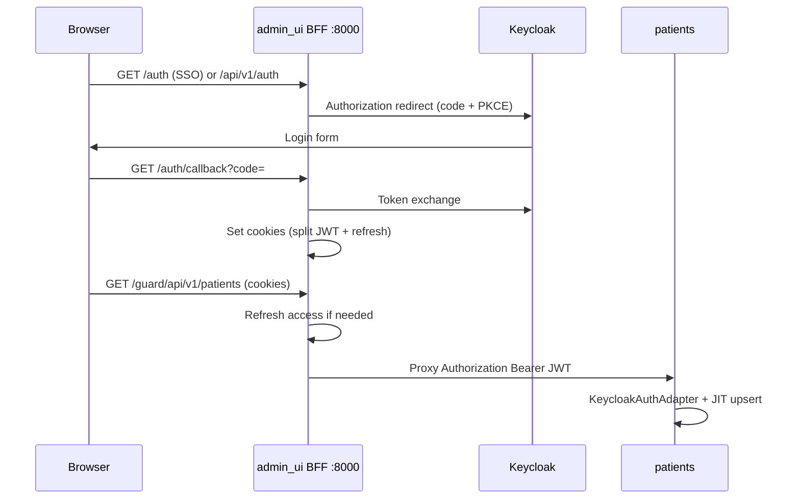

# Sprint 02 — admin_ui Pioneer

**Dates:** 6 Jul 2026 → 13 Jul 2026 (1 week)  
**Sprint goal:** Browser login via **admin_ui** BFF (:8000) with Keycloak JWT proxy to patients; gateway stories (NLS-50..59) for traceability.

**Status:** **Active** in Jira (project key `NLS`) — sprint **Sprint 02 — admin_ui Pioneer** (id **68**).

> **Architecture note (vs PaymentGate):** NeuroAtlas does **not** exchange Keycloak → AtomID. The **same Keycloak access token** is validated at `admin_ui` / backends. Embedded React + auth handlers follow PaymentGate `admin_ui` layout. See [`auth-paymentgate-comparison.md`](../diagrams/auth-paymentgate-comparison.md).



---

## Sprint issues on the board

### Gateway + browser auth (legacy — traceability)

| # | plan ref | Jira | Summary | Epic | Notes |
|---|----------|------|---------|------|-------|
| 1 | NLS-GW-01 | NLS-50 | Gateway scaffold (`src/gateway/`) | NLS-6 | Superseded by NLS-ADMIN-01 |
| 2 | NLS-GW-02 | NLS-51 | Reverse proxy | NLS-6 | Superseded by NLS-ADMIN-04 |
| 3 | NLS-GW-03 | NLS-52 | Keycloak browser client | NLS-8 | Superseded by NLS-ADMIN-02 |
| 4 | NLS-GW-04 | NLS-53 | OIDC routes | NLS-6 | Superseded by NLS-ADMIN-03 |
| 5 | NLS-GW-05 | NLS-54 | Session + Bearer forward | NLS-6 | Superseded by NLS-ADMIN-03 |
| 6 | NLS-GW-06 | NLS-55 | E2E smoke via gateway | NLS-7 | Superseded by NLS-ADMIN-08 |
| 7 | NLS-GW-07 | NLS-56 | Frontend browser login | NLS-13 | Superseded by NLS-ADMIN-05 |
| 8 | NLS-GW-08 | NLS-57 | Frontend API via gateway | NLS-13 | Superseded by NLS-ADMIN-05/07 |
| 9 | NLS-GW-09 | NLS-58 | Docker compose gateway | NLS-6 | Superseded by NLS-ADMIN-07 |
| 10 | NLS-GW-10 | NLS-59 | Auth diagram (gateway flow) | NLS-8 | Superseded by NLS-ADMIN-09 |

### admin_ui BFF + React panel (primary path)

| # | plan ref | Jira | Summary | Epic | Depends on |
|---|----------|------|---------|------|------------|
| 11 | NLS-ADMIN-01 | NLS-61 | `admin_ui` scaffold (`src/admin_ui/`) | NLS-6 | — |
| 12 | NLS-ADMIN-02 | NLS-62 | Keycloak `neuroatlas-ui` client | NLS-8 | NLS-14 |
| 13 | NLS-ADMIN-03 | NLS-63 | OIDC auth handlers (token, refresh, logout, `/auth/me`) | NLS-6 | NLS-62 |
| 14 | NLS-ADMIN-04 | NLS-64 | Guard proxy `/guard/api/v1/*` | NLS-6 | NLS-61 |
| 15 | NLS-ADMIN-05 | NLS-65 | React admin UI (auth + patients MVP) | NLS-13 | NLS-63 |
| 16 | NLS-ADMIN-06 | NLS-66 | Static SPA serving + `_env_` | NLS-6 | NLS-65 |
| 17 | NLS-ADMIN-07 | NLS-67 | Docker compose `admin_ui` on :8000 | NLS-6 | NLS-64 |
| 18 | NLS-ADMIN-08 | NLS-68 | E2E smoke via admin_ui | NLS-7 | NLS-63, NLS-17 |
| 19 | NLS-ADMIN-09 | NLS-69 | Auth diagram (admin_ui flow) | NLS-8 | — |

Verify sprint membership:

```powershell
.\scripts\jira\jira_api.ps1 sprint-issues 68
```

---

## Ops blocker — CI (Sprint 02 carry-over)

| # | plan ref | Jira | Summary | Epic | Notes |
|---|----------|------|---------|------|-------|
| 20 | NLS-705 | NLS-71 | Self-hosted GitLab Runner (`neuroatlas-self-hosted`) | NLS-12 | Unblocks pipelines when shared minutes exhausted |

Setup: [`docs/ci/self-hosted-runner.md`](../ci/self-hosted-runner.md)

---

## Definition of Done (sprint)

- [ ] Browser login through **admin_ui** reaches patients API with valid JWT
- [ ] Gateway stories linked or closed against NLS-ADMIN-* equivalents
- [ ] `make check` green on touched packages
- [ ] Sprint stories moved to Done in Jira; `plan.md` statuses updated

---

## NLS-68 — E2E smoke (admin_ui → patients + JIT)

Setup and run: [`docs/smoke/admin-ui-e2e.md`](../smoke/admin-ui-e2e.md)

```powershell
# infra/.env: AUTH_ENABLED=true, SMOKE_USERNAME, SMOKE_PASSWORD
.\make.ps1 up_infra
.\make.ps1 migrate
.\make.ps1 up_app
.\make.ps1 smoke_admin_ui
```

Manual browser check: [http://localhost:8000](http://localhost:8000) → login → Patients Registry.

---

## Recommended agent order

1. **NLS-ADMIN-01 → NLS-ADMIN-03 → NLS-ADMIN-04 → NLS-ADMIN-06 → NLS-ADMIN-07**
2. **NLS-ADMIN-08** E2E smoke
3. Parallel: **NLS-ADMIN-05** (React UI), **NLS-ADMIN-09** (docs)
4. Link or close **NLS-50..59** against admin_ui equivalents

Delegate implementation to **`implementer`** with Jira key + acceptance criteria from [sprint-01-pioneer.md](sprint-01-pioneer.md).
